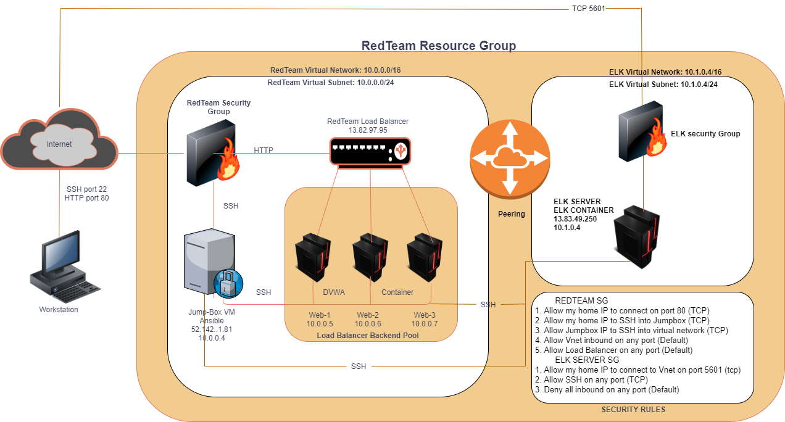

## Automated ELK Stack Deployment

* The files in this repository were used to configure the network depicted below.

These files have been tested and used to generate a live ELK deployment on Azure. They can be used to either recreate the entire deployment pictured above. Alternatively, select portions of the __Playbook__ file may be used to install only certain pieces of it, such as Filebeat.

  [Playbook file for ELK install](elk.yml)

### This document contains the following details:
- Description of the Topology
- Access Policies
- ELK Configuration
  - Beats in Use
  - Machines Being Monitored
- How to Use the Ansible Build

### Description of the Topology

The main purpose of this network is to expose a load-balanced and monitored instance of DVWA, the D*mn Vulnerable Web Application.

Load balancing ensures that the application will be highly __efficient__, in addition to restricting __traffic__ to the network.
- What aspect of security do load balancers protect? __Load balancers help to evenly distribute network traffic to prevent failure caused by overloading a particular resource. This improves the performance and availability of applications, websites, databases, and other computing resources__
- What is the advantage of a jump box? __A Jump box serves as gateway for access to infrastructure which reduces the size of any potential attack. it is also used to maintain tools for systems__

Integrating an ELK server allows users to easily monitor the vulnerable VMs for changes to the __Logs__ and system __metrics__.
- What does Filebeat watch for? __Filebeat watchs for any information that has been modified and when the modification took place__
- What does Metricbeat record? __Metricbeat watchs for change in system metrics such has change in cpu usage__

#### The configuration details of each machine may be found below.

| Name     | Function | IP Address | Operating System |    
|----------|----------|------------|------------------|      
| Jump Box | Gateway  | 10.0.0.4   | Linux            |      
| Web-1    | Server   | 10.0.0.5   | Linux            |
| Web-2    | Server   | 10.0.0.6   | Linux            |
| Elk VM   | Server   | 10.1.0.4   | Linux            |

### Access Policies

The machines on the internal network are not exposed to the public Internet. 

Only the __JumpBox Provisioner__ machine can accept connections from the Internet. Access to this machine is only allowed from my home IP address: 24.118.75.159

Machines within the network can only be accessed by __JumpBox Provisioner___.
- Which machine did you allow to access your ELK VM? __JumpBox internal IP__
- What was its IP address? __10.0.0.4__

A summary of the access policies in place can be found in the table below.

| Name     | Publicly Accessible | Allowed IP Addresses   |
|----------|---------------------|------------------------|
| Jump Box |     Yes             | Home IP: 24.118.75.159 |
| Web-1    |     No              | 10.0.0.4               |
| Web-2    |     No              | 10.0.0.4               |
| Elk VM   |     No              | 24.118.75.159, 10.0.0.4|
### Elk Configuration

Ansible was used to automate configuration of the ELK machine. No configuration was performed manually, which is advantageous because __Ansible allows to deploy to multiple servers using a single playbook__

The playbook implements the following tasks:
- Install docker.io
- Install Python-pip
- Install docker module
- Increase virtual memory
- Download and launch a docker elk container
- Enable service docker on boot

- 

The following screenshot displays the result of running `docker ps` after successfully configuring the ELK instance.

.png)

### Target Machines & Beats
This ELK server is configured to monitor the following machines:
- Web-1 (10.0.0.5)
- Web-2 (10.0.0.6)

We have installed the following Beats on these machines:
- Filebeat
- Metricbeat

These Beats allow us to collect the following information from each machine:
- Filebeat helps to collect for any information that has been modified and when the modification took place
- Metricbeat
- _TODO: In 1-2 sentences, explain what kind of data each beat collects, and provide 1 example of what you expect to see. E.g., `Winlogbeat` collects Windows logs, which we use to track user logon events, etc._

### Using the Playbook
In order to use the playbook, you will need to have an Ansible control node already configured. Assuming you have such a control node provisioned: 

SSH into the control node and follow the steps below:
- Copy the _____ file to _____.
- Update the _____ file to include...
- Run the playbook, and navigate to ____ to check that the installation worked as expected.

_TODO: Answer the following questions to fill in the blanks:_
- _Which file is the playbook? 
- Where do you copy it?_
- _Which file do you update to make Ansible run the playbook on a specific machine? 
- How do I specify which machine to install the ELK server on versus which to install Filebeat on?_C
- _Which URL do you navigate to in order to check that the ELK server is running? http://13.83.49.250:5601/app/kibana#/home

_As a **Bonus**, provide the specific commands the user will need to run to download the playbook, update the files, etc._
