## Web Application 1: Your Wish is My Command Injection
* Using the dot-dot-slash method to design two payloads that will display the contents
* Screenshot confirming the exploit was successfully executed on /etc/passwd
* 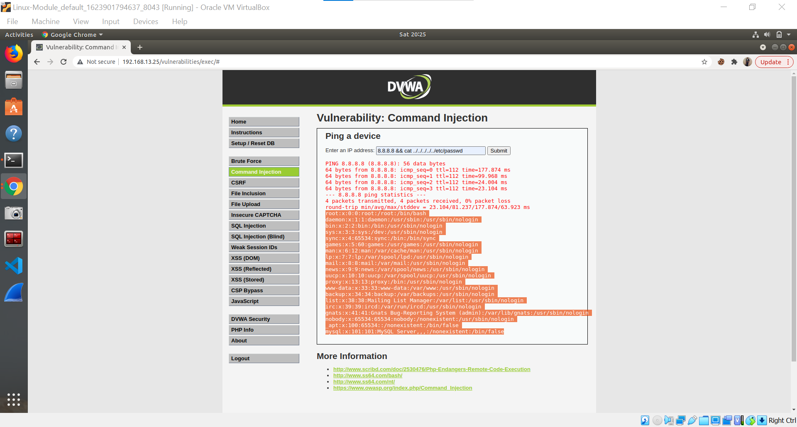
* Screenshot confirming the exploit was successfully executed on /etc/hosts
* `8.8.8.8 && cat ../../../../../etc/hosts`
* 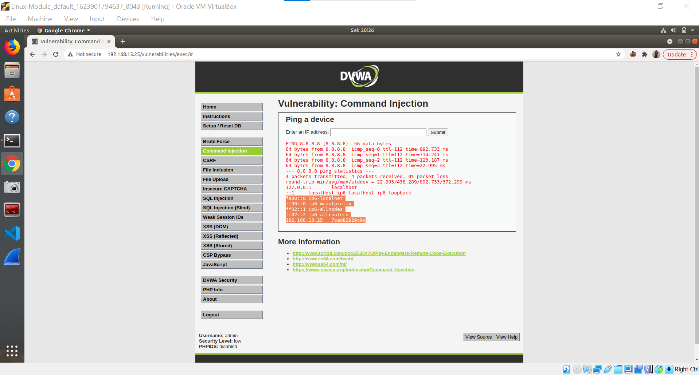

### Mitigation strategies
1. Set up input validation to prevent attacks like XSS and SQL Injection
2. Create a white list of possible inputs, to ensure the system accepts only pre-approved inputs
3. Avoid system calls and user input—to prevent threat actors from inserting characters into the OS command.

## Web Application 2: A Brute Force to Be Reckoned With
* 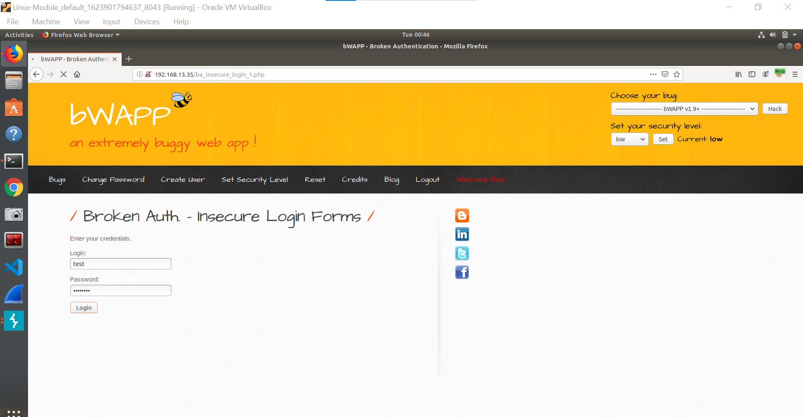
* 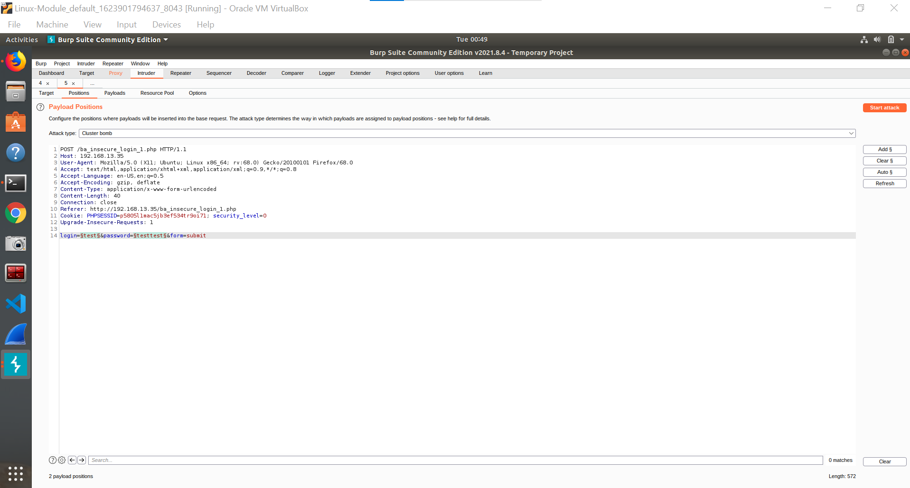
* 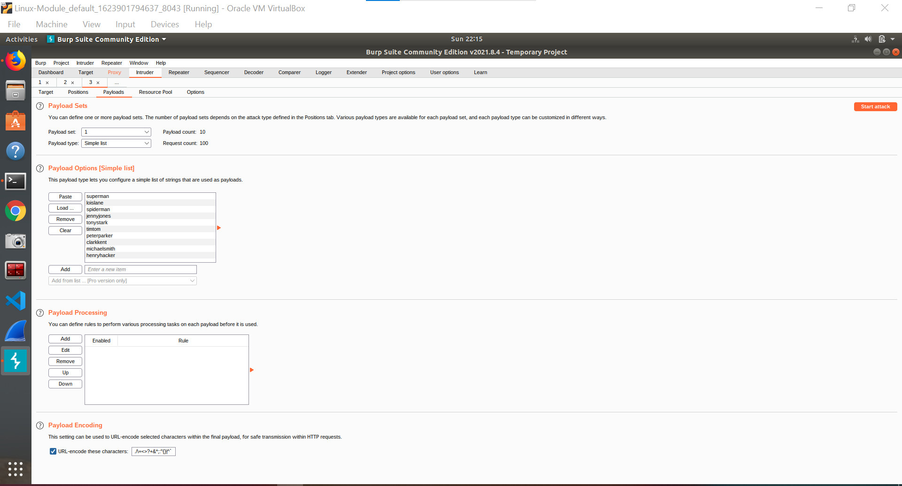
* 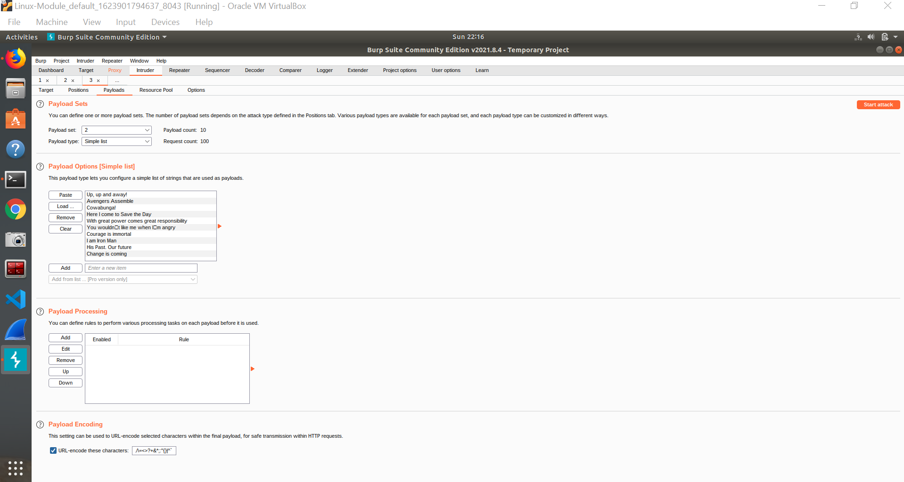
* 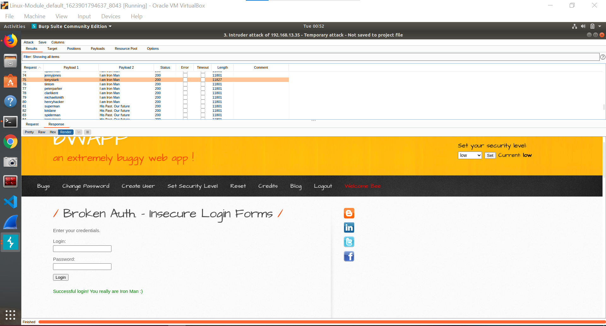

### Mitigation strategies
1. Limitation of login attempts
2. Use of Two-Factor Authentication 
3. Use Strong Passwords
## Web Application 3: Where's the BeEF
* 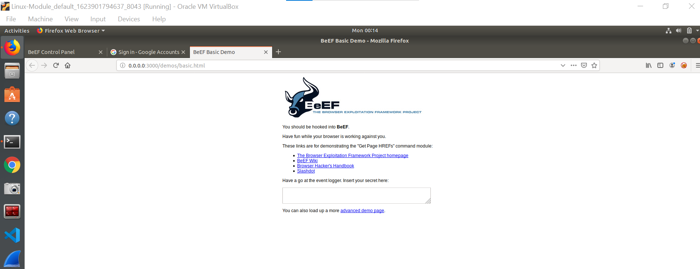
* 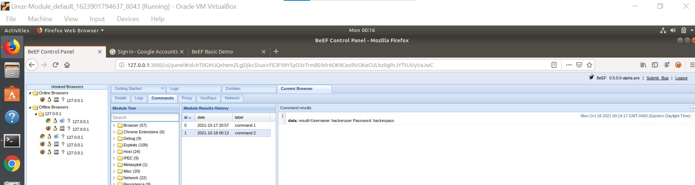
Social Engineering >> Pretty Theft
* 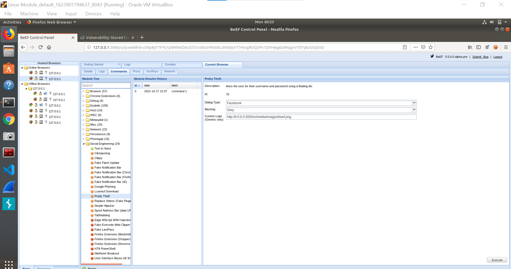
* 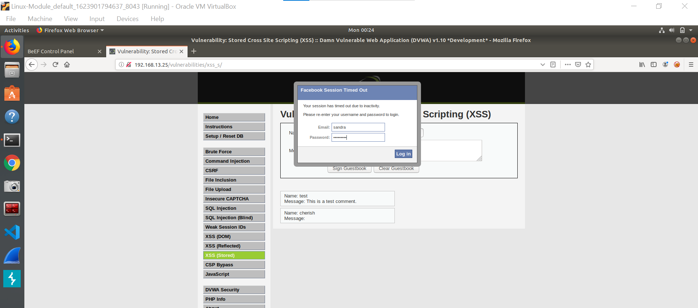
* 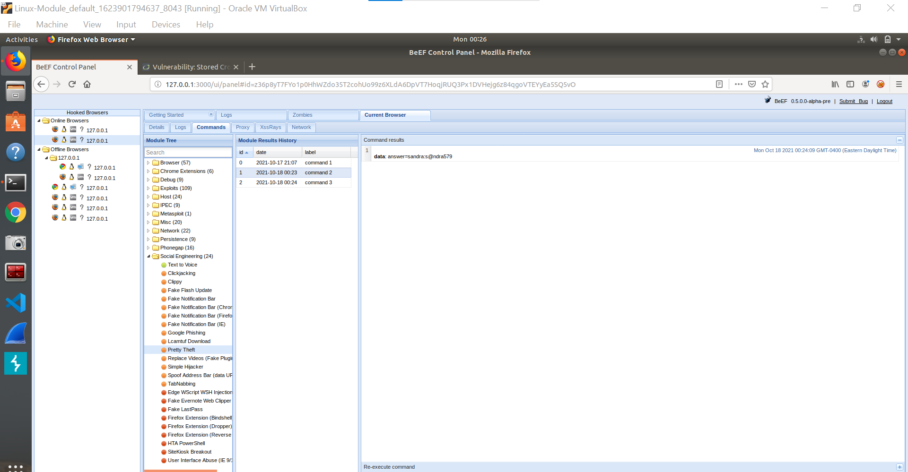
Social Engineering >> Fake Notification Bar
* 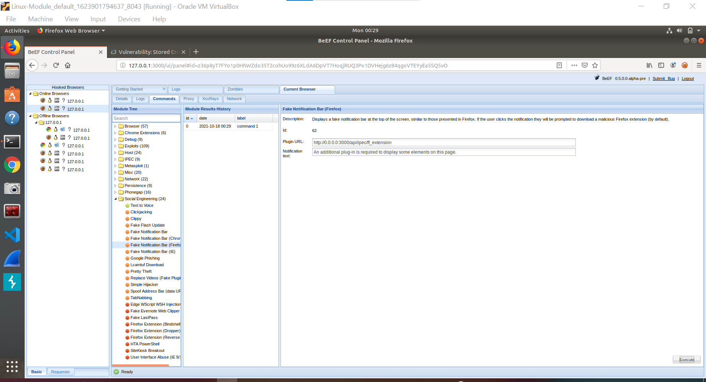
* 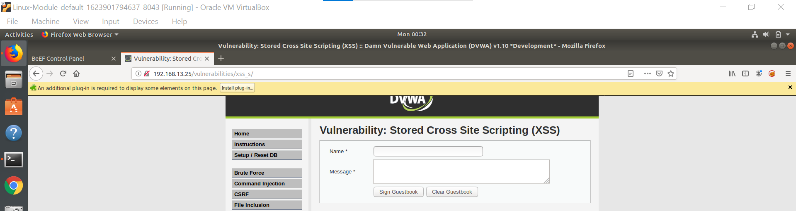
* 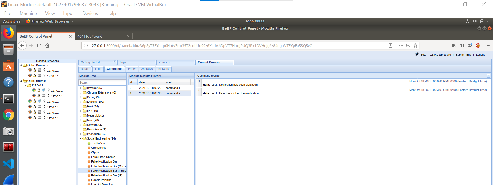
Host >> Get Geolocation (Third Party)
* 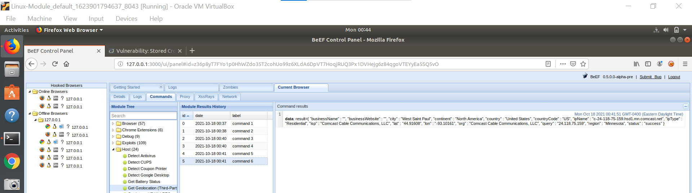
* 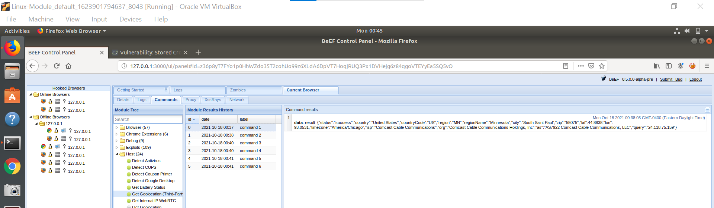

### Mitigation strategie
