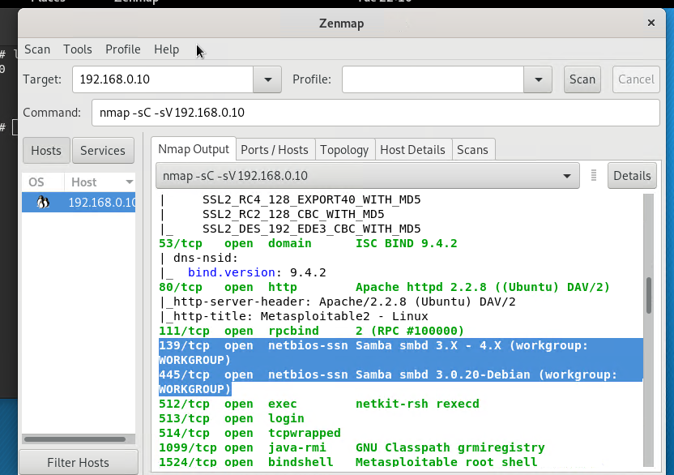
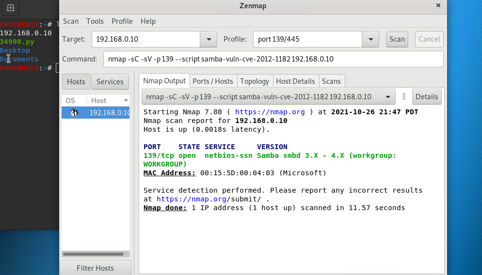
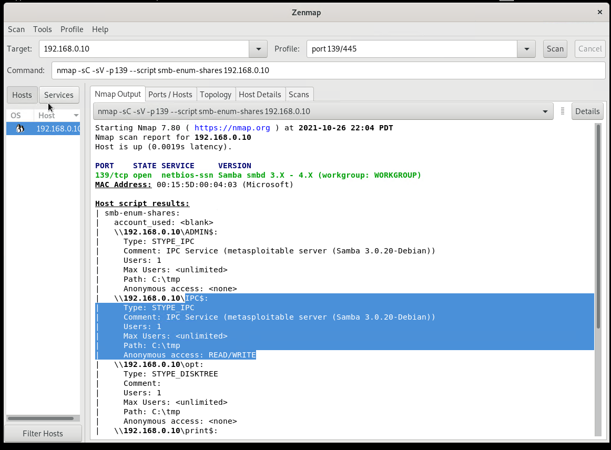
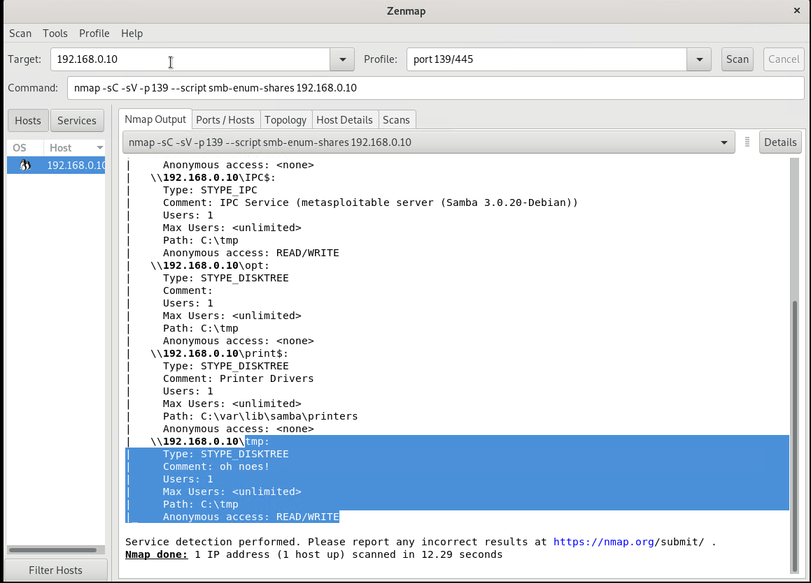
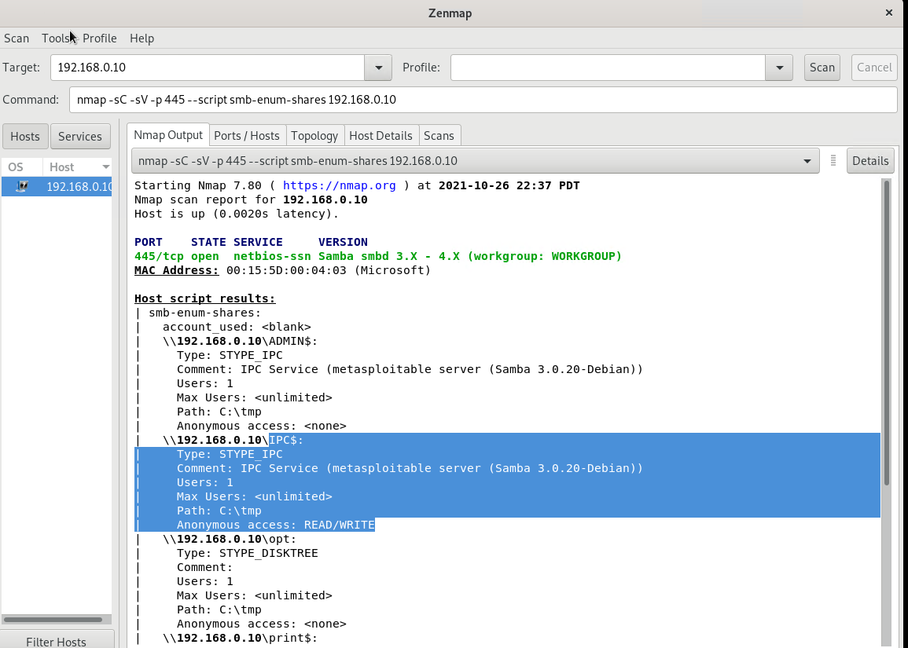

# Penetration Testing 1

## Step 1: Google Dorking
1. Using Google, can you identify who the Chief Executive Officer of Altoro Mutual is:
* *Karl Fitzgerald*
  * 
2. How can this information be helpful to an attacker:
* *This informatiom gives an attacker a target that probably has access to all the company's information*
## Step 2: DNS and Domain Discovery
Enter the IP address for demo.testfire.net into Domain Dossier and answer the following questions based on the results:
1. Where is the company located: *Sunnyvale, CA*
    * 
2. What is the NetRange IP address: *65.61.137.64 - 65.61.137.127*
    * 
3. What is the company they use to store their infrastructure: *Rackspace Backbone Engineering (C05762718)*
    * 
4. What is the IP address of the DNS server: *65.61.137.117*
    * 
## Step 3: Shodan
- What open ports and running services did Shodan find: *Ports 80/TCP, 443/TCP and 8080/TCP are open*
* Services: *Apache Tomcat/Coyote JSP Engine (version 1.1)*
  * 
## Step 4: Recon-ng
- Run recon-ng
  - Install the Recon module xssed: `marketplace install xssed`
       * 
  - Set the source to demo.testfire.net: `options set SOURCE demo.testfire.net`
      * 
  - Run the module: `run`
      * 
#### Is Altoro Mutual vulnerable to XSS: Yes
   * 

## Step 5: Zenmap
Your client has asked that you help identify any vulnerabilities with their file-sharing server. Using the Metasploitable machine to act as your client's server, complete the following:
- Command for Zenmap to run a service scan against the Metasploitable machine:
  - `nmap -sV -T4 -A -v 192.168.0.10` 
    - sV = Service and Version Scanning 
    - T(0-5): Set timing template (higher is faster) 
    - A = Agressive Scanning
    - v = Verbrose
    * 
- Bonus command to output results into a new text file named zenmapscan.txt: 
  - `nmap -sV -T4 -A -v 192.168.0.10 -oN zenmapscan.txt`
     * 
- Zenmap vulnerability script command: 
- `nmap -sV -sC 192.168.0.10` This command showed that port 139 and port 445 are running the same service
 -   
- NetBIOS services provide access to shared resources like files and printers to anyone across the internet
- Run this commands to check for vulnerability  
- `nmap -sV -sC -p 139 --script samba-vuln-cve-2012-1182 192.168.0.10` and `nmap -sV -sC -p 445 --script samba-vuln-cve-2012-1182 192.168.0.10` This command showed that there is no vulnerability with this script on port 139 and 445 
  - 
  - 
- Run this command to check for access vulnerability
-  `nmap -sV -sC -p 139 --script smb-enum-shares 192.168.0.10`
  - 
  - 
-  `nmap -sV -sC -p 445 --script smb-enum-shares 192.168.0.10`
  - 
  - 
- Once you have identified this vulnerability, answer the following questions for your client:
  - What is the vulnerability:
  - Why is it dangerous:
  - What mitigation strategies can you recommendations for the client to protect their server:
