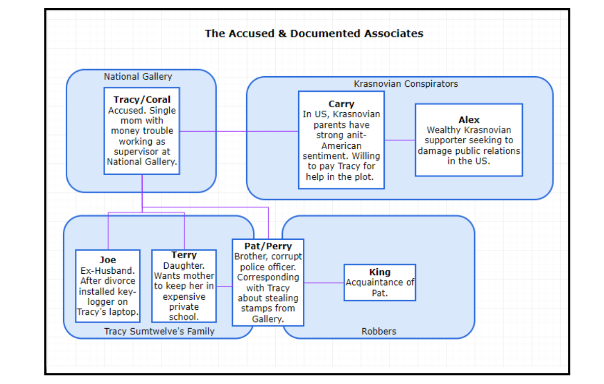

# Digital Forensics
#### Note: The report of this project is attached ['Final Report'](Forensics%20Final%20Report.pdf) in pdf format
## Case Summary 
- Tracy is an employee at the National Gallery. Her daughter attends an expensive private high school that Tracy cannot afford on her own, and her ex-husband Joe refuses to help pay if the daughter does not live with him. Her daughter refuses to go to any other school.

- Knowing she needs money, a family friend named Carry offers to pay her if she agrees to sneak certain prohibited items (including a tablet) into the museum for the sake of a “flash mob.” However, Carry is really trying to undermine Majavia-American relations because of her extremist pro-Krasnovian background. Rather than a flashmob, she is actually organizing an attempt to deface valuable cultural Majavian artwork.

- In addition to this, Tracy and her brother plan to steal valuable assets from the museum. Because Joe had a keylogger installed on Tracy’s phone to keep an eye on their daughter, he became aware of the situation and alerted the authorities, which in turn led to the seizure of Tracy’s phone.

- 
