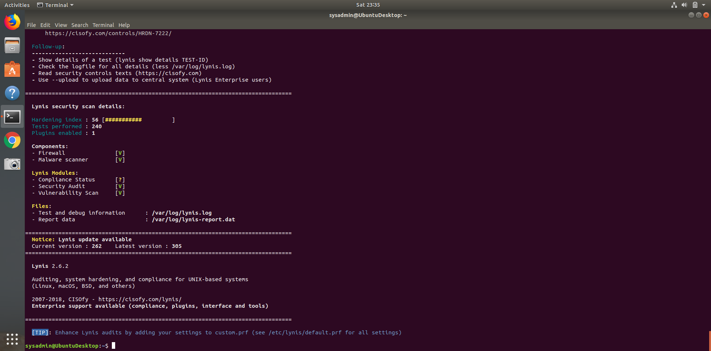
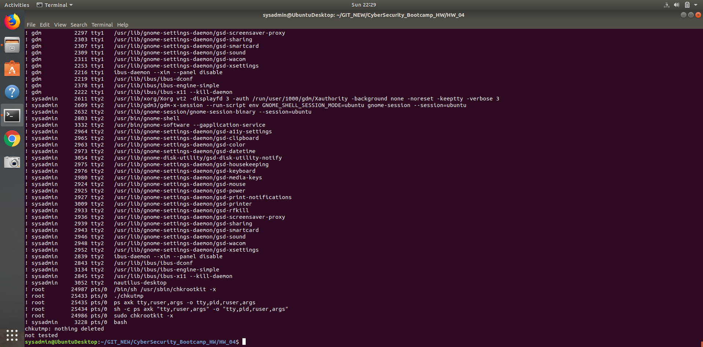

# Submission File: Linux Systems Administration
### Step 1: Ensure/Double Check Permissions on Sensitive Files
1. Permissions on /etc/shadow should allow only root read and write access
* Command to inspect permissions: ls -l /etc/shadow
* Command to set permissions (not needed): chmod 600 /etc/shadow
2. Permissions on /etc/gshadow should allow only root read and write access
* Command to inspect permissions: ls -l /etc/gshadow
* Command to set permissions (not needed): chmod 600 /etc/gshadow
3. Permissions on /etc/group should allow only root read and write access
* Command to inspect permissions: ls -l /etc/group
* Command to set permissions (not needed): chmod 644 /etc/group
4.Permissions on /etc/passwd should allow only root read and write access
* Command to inspect permissions: ls -l /etc/passwd
* Command to set permissions (not needed): chmod 644 /etc/passwd

### Step 2: Create User Accounts 
1. Add user accounts for sam, joe, amy, sara, and admin
* Command to add sam: sudo adduser sam
* Command to add joe: sudo adduser joe
* Command to add amy: sudo adduser amy
* Command to add sara: sudo adduser sara
* Command to add admin: sudo adduser admin
2. Ensure that only the admin has general sudo access
* Command to add admin to the sudo group: sudo usermod -aG sudo admin

### Create User Group and Collaborative Folder
1. Add an engineers group to the system
* Command to add group: sudo addgroup engineers
2. Add users sam, joe, amy, and sara to the managed group
* Command to add sam to engineers group: sudo usermod -aG engineers sam
* Command to add joe to engineers group: sudo usermod -aG engineers joe
* Command to add amy to engineers group: sudo usermod -aG engineers amy
* Command to add sara to engineers group: sudo usermod -aG engineers sara
3. Create a shared folder for this group at /home/engineers.
* Command to create the shared folder: sudo mkdir /home/engineers
4. Change ownership on the new engineers' shared folder to the engineers group.
* Command to change ownership of engineer's shared folder to engineer group: sudo chown root:engineers engineers

### Step 4: Lynis Auditing
1. Command to install Lynis: sudo apt install lynis
2. Command to see documentation and instructions: man lynis
3. Command to run an audit: sudo lynis audit system
4. Screenshot of report output:
      

### Bonus
1. Command to install chkrootkit: sudo apt install chkrootkit
2. Command to see documentation and instructions: man chkrootkit
3. Command to run expert mode: sudo chkrootkit -x
4. Screenshot of end of sample output
      

