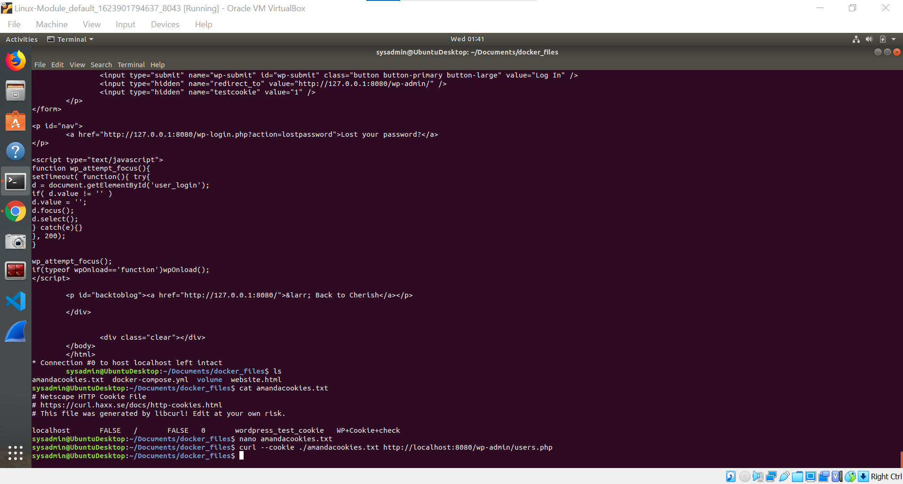
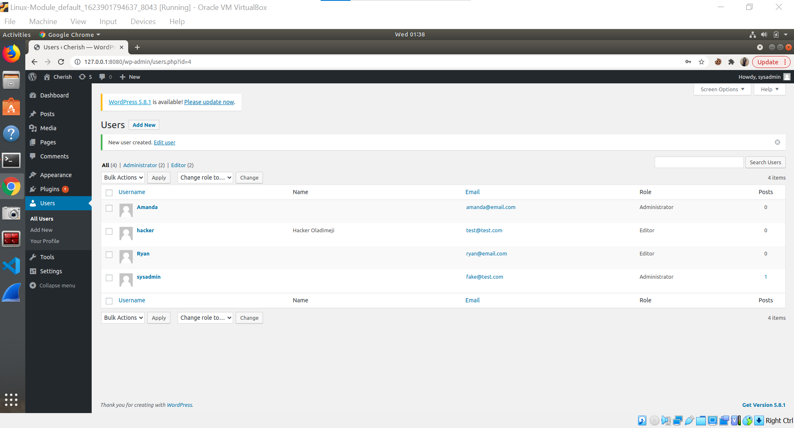
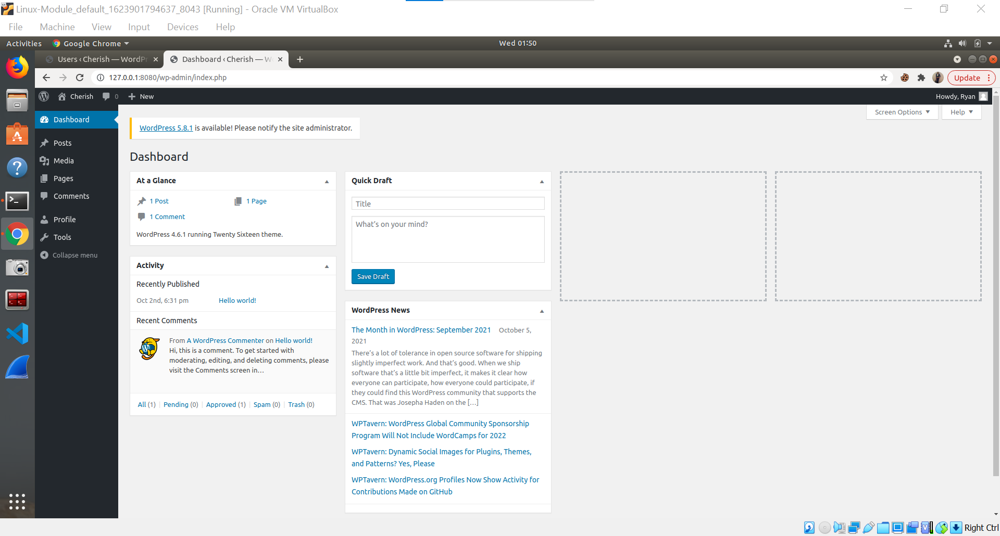
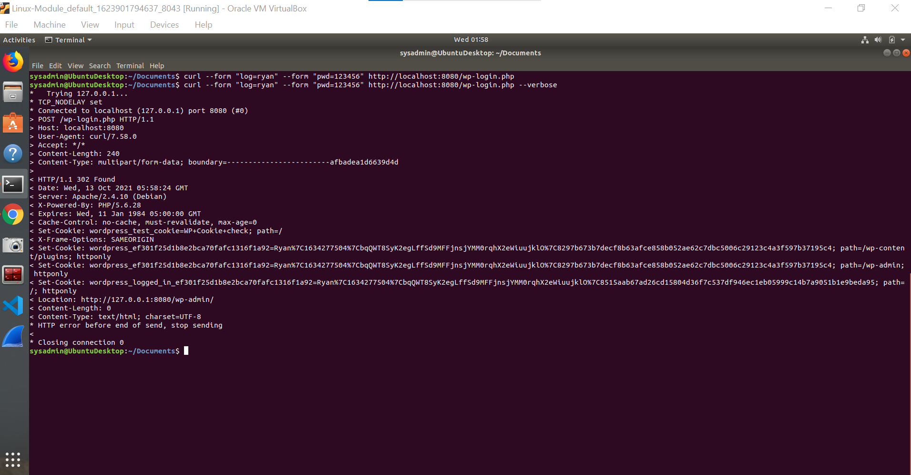
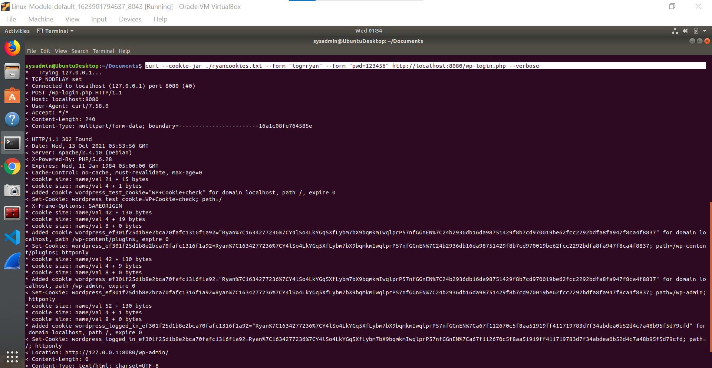
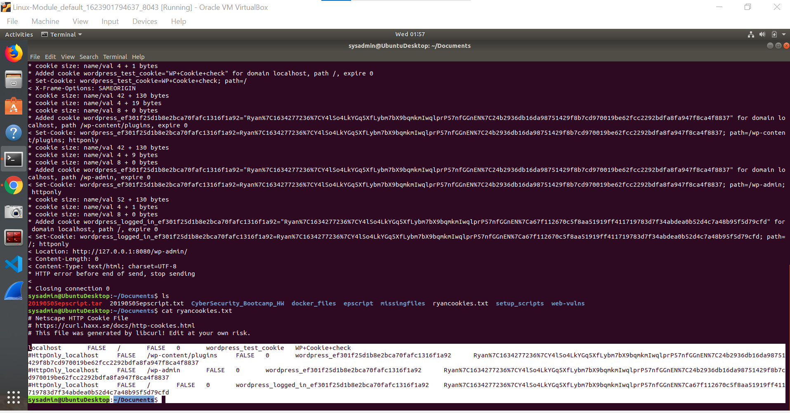
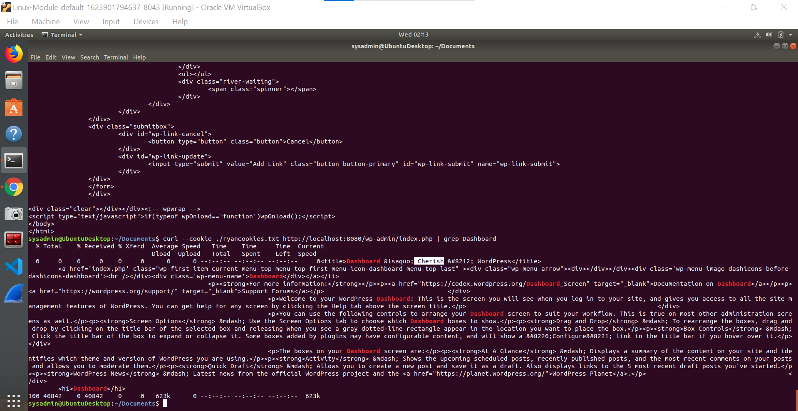
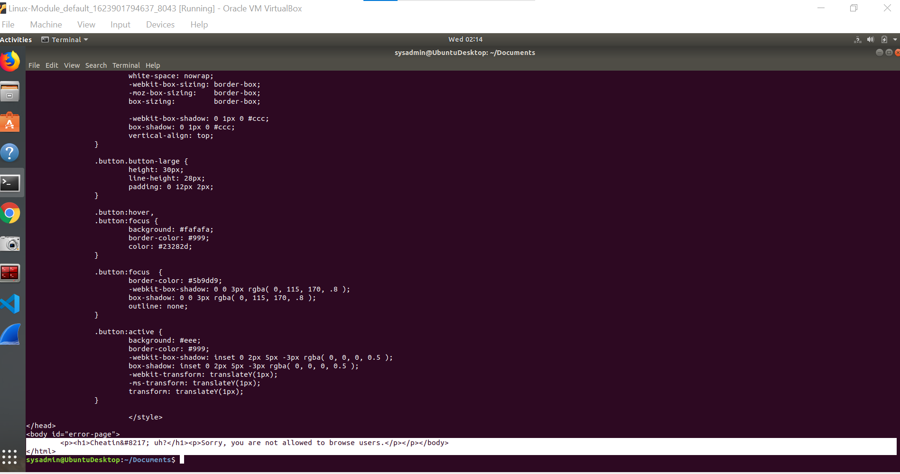

# Web Development Homework
## HTTP Requests and Responses
1) What type of architecture does the HTTP request and response process occur in?
* Client-Server Architecture
2) What are the different parts of an HTTP request?
* Request Line 
* Headers 
* Body
3) Which part of an HTTP request is optional?
* Request Body
4) What are the three parts of an HTTP response?
* Status Line 
* Headers 
* Response Body
5) Which number class of status codes represents errors?
* 400 class
6) What are the two most common request methods that a security professional will encounter?
* Get
* Post
7) Which type of HTTP request method is used for sending data?
 * Post
8) Which part of an HTTP request contains the data being sent to the server?
* Body
9) In which part of an HTTP response does the browser receive the web code to generate and style a web page?
* Body

## Using curl
10) What are the advantages of using curl over the browser?
* To ensure web servers don't leak sensitive data through their HTTP responses
* To test web server security configurations
* To look for vulnerabilities on a web server
* To verify that servers only respond to certain request types
11) Which curl option is used to change the request method?
* -X
12) Which curl option is used to set request headers?
* -H
13) curl option is used to view the response header?
* -I
14) Which request method might an attacker use to figure out which HTTP requests an HTTP server will accept?
* OPTIONS

## Sessions and Cookies
```
HTTP/1.1 200 OK
Content-type: text/html
Set-Cookie: cart=Bob
```
15) Which response header sends a cookie to the client?
* Set-Cookie
```
GET /cart HTTP/1.1
Host: www.example.org
Cookie: cart=Bob
```
16) Which request header will continue the client's session?
* Cookie
## Example HTTP Requests and Responses
### HTTP Request
```
POST /login.php HTTP/1.1
Host: example.com
Accept-Encoding: gzip, deflate, br
Connection: keep-alive
Content-Type: application/x-www-form-urlencoded
Content-Length: 34
Upgrade-Insecure-Requests: 1
User-Agent: Mozilla/5.0 (Linux; Android 6.0; Nexus 5 Build/MRA58N) AppleWebKit/537.36 (KHTML, like Gecko) Chrome/80.0.3987.132 Mobile Safari/537.36

username=Barbara&password=password
```
17) What is the request method?
* POST request
18) Which header expresses the client's preference for an encrypted response?
* Upgrade-Insecure-Requests: 1
19) Does the request have a user session associated with it?
* There is no user session associated since there is no set-cookie
20) What kind of data is being sent from this request body?
* Login credentials 
### HTTP Response 
```
HTTP/1.1 200 OK
Date: Mon, 16 Mar 2020 17:05:43 GMT
Last-Modified: Sat, 01 Feb 2020 00:00:00 GMT
Content-Encoding: gzip
Expires: Fri, 01 May 2020 00:00:00 GMT
Server: Apache
Set-Cookie: SessionID=5
Content-Type: text/html; charset=UTF-8
Strict-Transport-Security: max-age=31536000; includeSubDomains
X-Content-Type: NoSniff
X-Frame-Options: DENY
X-XSS-Protection: 1; mode=block

[page content]
```
21) What is the response status code?
* 200 OK
22) What web server is handling this HTTP response?
* Apache 
23) Does this response have a user session associated to it?
* yes it has. `Set-Cookie: SessionID=5`
24) What kind of content is likely to be in the [page content] response body?
* it contains the resource requested by the client, all of the web code and styling that the browser uses to format the page
25) If your class covered security headers, what security request headers have been included?
```
* Strict-Transport-Security: max-age=31536000; includeSubDomains
* X-Content-Type: NoSniff
* X-Frame-Options: DENY
* X-XSS-Protection: 1; mode=block
```
## Monoliths and Microservices
26) What are the individual components of microservices called?
* Front-end, back-end, and database components
27) What is a service that writes to a database and communicates to other services?
* Application Programming Interfaces (APIs)
28) What type of underlying technology allows for microservices to become scalable and have redundancy?
* Replication of identical components allow to serve more clients and provides identical backup components if one fails
## Deploying and Testing a Container Set
29) What tool can be used to deploy multiple containers at once?
* Docker Compose
30) What kind of file format is required for us to deploy a container set?
* YAML file
## Databases
31) Which type of SQL query would we use to see all of the information within a table called customers?
* `SELECT * FROM customers;`
32) Which type of SQL query would we use to enter new data into a table?
* INSERT INTO customers (column1, column2, column3, ...)
33) Why would we never run `DELETE FROM <table-name>;` by itself?
* It will delete the entire table. it needs to be more specific to what to delete


##  BONUS Challenge Overview: The Cookie Jar
### Logging In and Saving Cookies with Curl
* `curl --cookie-jar ./amandacookies.txt --form "log=Amanda" --form "pwd=password" http://localhost:8080/wp-login.php --verbose`
* 
 
### Using a Saved Cookie
* `curl --cookie ./amandacookies.txt http://localhost:8080/wp-admin/users.php`
* 

## Bonus: The Cookie Jar
### Step 1: Set Up
* Added new users
* 
### Step 2: Baselining
1. Log into your WordPress site as sysadmin(Cherish) account and navigate to localhost:8080/wp-admin/users.php. Examine this page briefly 
* 
2. Log into your Ryan account and attempt to navigate to localhost:8080/wp-admin/index.php. Note the wording on your Dashboard.
* 
3. Attempt to navigate to localhost:8080/wp-admin/users.php. Note what you see now
* 
### Step 3: Using Forms and a Cookie Jar
1. Curl command to login ryan
* `curl --form "log=ryan" --form "pwd=123456" http://localhost:8080/wp-login.php`
* No obvious confirmation of a login
* 
2. Curl command to login and save cookie
* `curl --cookie-jar ./ryancookies.txt --form "log=ryan" --form "pwd=123456" http://localhost:8080/wp-login.php --verbose`
* 
3. contents of the ryancookies.txt file
* `cat ryancookies.txt`
* 3 itmes exist in this file
* 
### Step 4: Log in Using Cookies
1. Command to use saved cookie
* `curl --cookie ./ryancookies.txt http://localhost:8080/wp-admin/index.php`
* Yes it is obvious that we can access the Dashboard
* 
2. Command to use saved cookie piped to grep
* `curl --cookie ./ryancookies.txt http://localhost:8080/wp-admin/index.php | grep Dashboard`
* The wording on the page that seems familiar is Cherish(Sysadmin), >At a Glance<, Welcome to your WordPress Dahboard
* 
### Step 5: Test the Users.php Page
1. Command to attempt to access Users
* `curl --cookie ./ryancookies.txt http://localhost:8080/wp-admin/users.php`
* An error popped up 'sorry, you are not allowed to browse users'
*  
