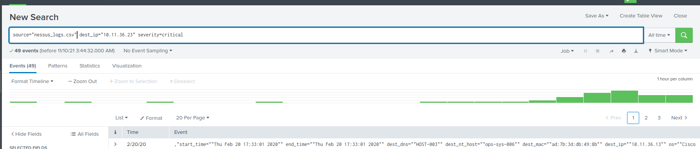

# Homework: Lets go Splunking
## Step 1: The Need for Speed
1. Upload file of the system speeds around the time of the attack; server_speedtest.csv
- 
2. Query to show the ratio between the upload and download speeds
- Query - `source="server_speedtest.csv" | eval ratio = UPLOAD_MEGABITS / DOWNLOAD_MEGABITS`
- 
3. Query to create a report that displays the following fields in a statistics report: _time, IP_ADDRESS, DOWNLOAD_MEGABITS, UPLOAD_MEGABITS, ratio
- Query - `source="server_speedtest.csv" | table _time,IP_ADDRESS,DOWNLOAD_MEGABITS,UPLOAD_MEGABITS | eval ratio = DOWNLOAD_MEGABITS / UPLOAD_MEGABITS`
- 
4. As highlighted in the picture above, the approximate date and time of the attack is 02/23/2020 at 2:30pm (14:30:00)
- The system fully recover around 11:30 pm (23:30:00) on 02/23/2020, Took the system about 9 hours to recover.

## Step 2: Are We Vulnerable?
1. Upload file of the Nessus vulnerability scan file; nessus_logs.csv
- 
- 
2. Query to create a report that shows the count of critical vulnerabilities from the customer database server IP 10.11.36.23
- Query - `source="nessus_logs.csv" dest_ip="10.11.36.23" dest_ip="10.11.36.23" severity=critical`
- 
3. Alert that monitors every day to see if this server has any critical vulnerabilities, with alert being emailed to soc@vandalay.com
- 
- 
- 

## Step 3: Drawing the (base)line
1. Upload administrator login logs; Administrator_logs.csv
- 
2. the brute force attack occur Feb 21, 2020 between the hours of 8:00am and 2:00pm
- 
3. Determined baseline is approximately 20 logins in an hour and the threshold is a count greater than 30
4. Alert that monitors potential Brute force every hour
- 
- 
- 
