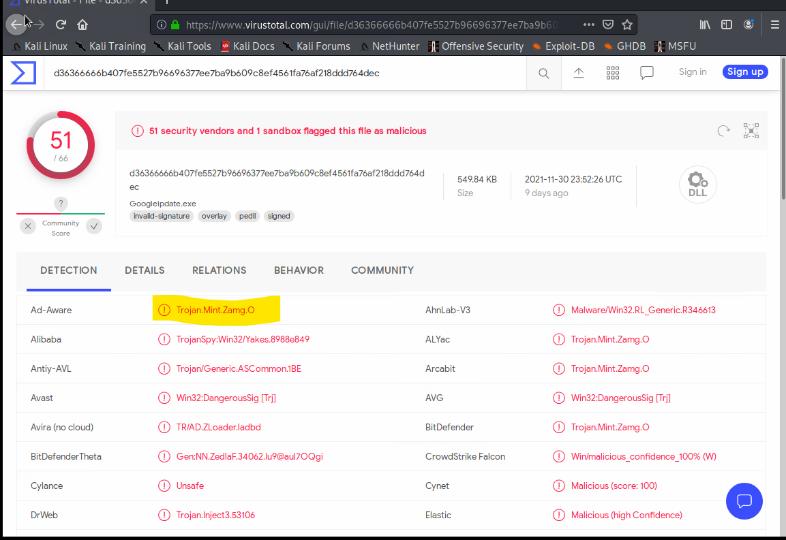
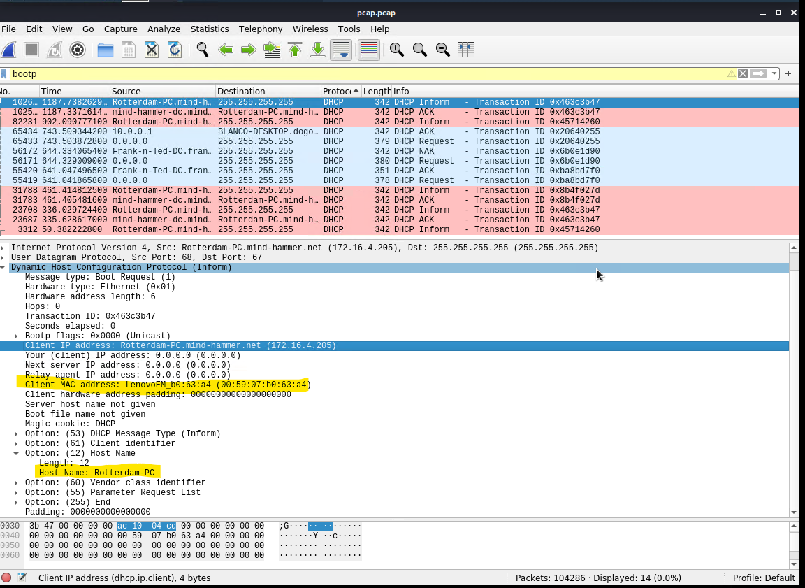

## Red Team: Summary of Operations
### Table of Contents

- Exposed Services
- Critical Vulnerabilities
- Exploitation

#### Exposed Services
- Nmap scan results for each machine reveal the below services and OS details:
    - `nmap ... # TODO: Add command to Scan Target 1`
- scan image
- This scan identifies the services below as potential points of entry:
  - Target 1 List of Exposed Services
    - ssh
    - 

TODO: Fill out the list below. Include severity, and CVE numbers, if possible.
- The following vulnerabilities were identified on each target:
- Target 1
    - List of Critical Vulnerabilities

TODO: Include vulnerability scan results to prove the identified vulnerabilities.

#### Exploitation
TODO: Fill out the details below. Include screenshots where possible.
- The Red Team was able to penetrate Target 1 and retrieve the following confidential data:
- Target 1
  - flag1.txt: TODO: Insert flag1.txt hash value
    - Exploit Used
      - TODO: Identify the exploit used
      - TODO: Include the command run
  - flag2.txt: TODO: Insert flag2.txt hash value
    - Exploit Used
      - TODO: Identify the exploit used
      - TODO: Include the command run

## Blue Team: Summary of Operations
### Table of Contents
- Network Topology
- Description of Targets
- Monitoring the Targets
- Patterns of Traffic & Behavior
- Suggestions for Going Further

#### Network Topology
TODO: Fill out the information below.
- The following machines were identified on the network:
  - Name of VM 1
    - Operating System:
    - Purpose:
    - IP Address:
  - Name of VM 2
    - Operating System:
    - Purpose:
    - IP Address:

#### Description of Targets
TODO: Answer the questions below.
- The target of this attack was: Target 1 (TODO: IP Address).
- Target 1 is an Apache web server and has SSH enabled, so ports 80 and 22 are possible ports of entry for attackers. As such, the following alerts have been implemented:

#### Monitoring the Targets
Traffic to these services should be carefully monitored. To this end, we have implemented the alerts below:

#### Name of Alert 1
TODO: Replace Alert 1 with the name of the alert.
- Alert 1 is implemented as follows:
  - Metric: TODO
  - Threshold: TODO
  - Vulnerability Mitigated: TODO
  - Reliability: TODO: Does this alert generate lots of false positives/false negatives? Rate as low, medium, or high reliability.

#### Name of Alert 2
- Alert 2 is implemented as follows:
  - Metric: TODO
  - Threshold: TODO
  - Vulnerability Mitigated: TODO
  - Reliability: TODO: Does this alert generate lots of false positives/false negatives? Rate as low, medium, or high reliability.

#### Name of Alert 3
- Alert 3 is implemented as follows:
  - Metric: TODO
  - Threshold: TODO
  - Vulnerability Mitigated: TODO
  - Reliability: TODO: Does this alert generate lots of false positives/false negatives? Rate as low, medium, or high reliability.
TODO Note: Explain at least 3 alerts. Add more if time allows.

#### Suggestions for Going Further (Optional)
TODO:

- Each alert above pertains to a specific vulnerability/exploit. Recall that alerts only detect malicious behavior, but do not stop it. For each vulnerability/exploit identified by the alerts above, suggest a patch. E.g., implementing a blocklist is an effective tactic against brute-force attacks. It is not necessary to explain how to implement each patch.
- The logs and alerts generated during the assessment suggest that this network is susceptible to several active threats, identified by the alerts above. In addition to watching for occurrences of such threats, the network should be hardened against them. The Blue Team suggests that IT implement the fixes below to protect the network:

- Vulnerability 1
  - Patch: TODO: E.g., install special-security-package with apt-get
  - Why It Works: TODO: E.g., special-security-package scans the system for viruses every day
- Vulnerability 2
  - Patch: TODO: E.g., install special-security-package with apt-get
  - Why It Works: TODO: E.g., special-security-package scans the system for viruses every day
- Vulnerability 3
  - Patch: TODO: E.g., install special-security-package with apt-get
  - Why It Works: TODO: E.g., special-security-package scans the system for viruses every day


## Network Forensic Analysis Report
### Time Thieves
- At least two users on the network have been wasting time on YouTube. Usually, IT wouldn't pay much mind to this behavior, but it seems these people have created their own web server on the corporate network. So far, Security knows the following about these time thieves:
  - They have set up an Active Directory network.
  - They are constantly watching videos on YouTube.
  - Their IP addresses are somewhere in the range 10.6.12.0/24
- By Inspecting the traffic captured in ['pcap file'](https://drive.google.com/file/d/1ggMVl1t_DZfw1WB93FO6hMLe5Ffqz40F/view) we found the following evidence. We ran the curl command to get the pcap into the wire shark `curl -L -o pcap.pcap http://tinyurl.com/yaajh8o8`
1. The domain name of the users' custom site is frank-n-ted-dc.frank-n-ted.com. We found this information by running the this query: `ip.src == 10.6.12.0/24` in the filter
  - 
2. Using this query: `ip.src == 10.6.12.0/24`, the IP address of the Domain Controller (DC) of the AD network is `10.6.12.12`
 - 

3. A malware was downloaded into the 10.6.12.203 machine. We ran the query `ip.src == 10.6.12.203` and found the suspicious http get file named `june11.dll` and exported objects http stream and saved the file.
 -   
 - 

4. After saving we put it into virustotal.com and found the malware to be `Trojan.Mint.Zamg.O`
 - 

5. The virus is Trojan.Mint.Zamg.O and it is classified as Ad-Ware
  - 

### Vulnerable Windows Machine
- The Security team received reports of an infected Windows host on the network. They know the following:
  - Machines in the network live in the range 172.16.4.0/24.
  - The domain mind-hammer.net is associated with the infected computer.
  - The DC for this network lives at 172.16.4.4 and is named Mind-Hammer-DC.
  - The network has standard gateway and broadcast addresses
- By Inspecting the traffic captured in ['pcap file'](https://drive.google.com/file/d/1ggMVl1t_DZfw1WB93FO6hMLe5Ffqz40F/view) we found the following information
- We found few information on this website ['Palo alto'](https://unit42.paloaltonetworks.com/using-wireshark-identifying-hosts-and-users/) which helped in getting the necessary information

1. The following information about the infected Windows machine are listed below:
```    
    - Host name: Rotterdam-PC.mindhammer.net
    - IP address: 172.16.4.205     
    - MAC address: LenovoEM_b0:63:a4 (00:59:07:b0:63:a4)
```
- We found the above information by running this query `bootp` and looking into the dhcp information
  - 

2. The username of the Windows user whose computer is infected matthijs.devries. We found this information by running the query `ip.addr == 172.16.4.205 && kerberos.CNameString`
  - 
  
3. To find the IP addresses used in the actual infection traffic, We re-ran the kerberos command. We pulled up the statistics and went into conversations to sort out the packets and chose the 2 IP address with the highest packets
```  
  - 185.243.115.84
  - 166.62.111.64
```
  - The screenshot shows that alot of communication is going on between the infected machine 172.16.4.205 and these IPs 185.243.115.84, 166.62.111.64
  - 

4. We retrieved the desktop background of the Windows host by exporting the http traffic as an object.  We went into `files and export as object`. We searched for `img` and saved the result and we were able to view the image
- 
- 

### Illegal Downloads
- IT was informed that some users are torrenting on the network. The Security team does not forbid the use of torrents for legitimate purposes, such as downloading operating systems. However, they have a strict policy against copyright infringement.
- IT shared the following about the torrent activity:
  - The machines using torrents live in the range 10.0.0.0/24 and are clients of an AD domain.
  - The DC of this domain lives at 10.0.0.2 and is named DogOfTheYear-DC.
  - The DC is associated with the domain dogoftheyear.net.

1. The following information is about the machine with IP address 10.0.0.201:
    - MAC address: Msi_18:66:c8 (00:16:17:18:66:c8) (Using `bootp` or `ip.addr == 10.0.0.201 && dhcp` as query)
    - 
    - Windows username: elmer.blanco (Using Keberos query: `ip.addr == 10.0.0.201 && kerberos.CNameString` as query)
    - 
    - OS version: Windows NT 10.0; Win64; x64 (Using this query: `ip.addr == 10.0.0.201 && http.request` as query)
    - 
2. To find the torrent file the user downloaded, we used this query: `ip.addr == 10.0.0.201 && (http.request.uri contains ".torrent")` to find out more about URI that contains torrent
 - 
 - By exporting the http file. we searched for the possible torrent file downloaded and we found the http application/x-bitorrent link - btdownload.php?type=torrent&file=Betty_Boop_Rhythm_on_the_Reservation.avi.torrent
 - 
- We found a jpg files with similar name to our URI information and we saved this file to view the content
  - 
- This content shows that some contents have been downloaded and this maybe be a potential copyright infringement 
  -  


